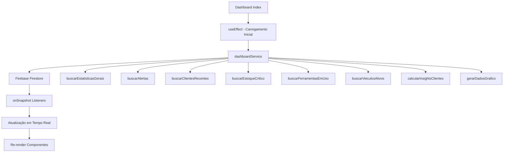

# Design Document - Dashboard Apple Premium

## Overview

Este documento detalha o design técnico e visual para a melhoria completa do Dashboard existente em `/dashboard`. O objetivo é transformá-lo em um dashboard premium estilo Apple, com dados 100% reais do Firebase, gráficos interativos, insights inteligentes e microanimações fluidas. O dashboard atual já possui estrutura base com alguns componentes (CartaoIndicador, LoaderAnimado, GraficoFinanceiro, InsightsClientes), que serão mantidos e expandidos.

## Architecture

### Estrutura de Componentes

```
src/pages/dashboard/
├── index.jsx                          # Página principal (EXISTENTE - será melhorado)
├── componentes/
│   ├── CartaoIndicador.jsx           # KPI Cards (EXISTENTE - OK)
│   ├── LoaderAnimado.jsx             # Skeleton loaders (EXISTENTE - OK)
│   ├── GraficoFinanceiro.jsx         # Gráfico de receita (EXISTENTE - será melhorado)
│   ├── InsightsClientes.jsx          # Insights de clientes (EXISTENTE - será melhorado)
│   ├── CentralAlertas.jsx            # Central de alertas (EXISTENTE - será melhorado)
│   ├── WidgetClima.jsx               # Widget de clima (EXISTENTE - será melhorado)
│   ├── ListaClientesRecentes.jsx    # NOVO - Lista dos últimos clientes
│   ├── EstoqueCritico.jsx           # NOVO - Produtos com estoque baixo
│   ├── FerramentasEmUso.jsx         # NOVO - Ferramentas em uso
│   ├── VeiculosAtivos.jsx           # NOVO - Veículos em serviço
│   └── GraficoMovimentacao.jsx      # NOVO - Gráfico de movimentação semanal
├── servicos/
│   └── dashboardService.js           # Serviço Firebase (EXISTENTE - será expandido)
└── estilos/
    └── dashboard.css                  # Estilos customizados (EXISTENTE - será expandido)
```

### Fluxo de Dados



## Components and Interfaces

### 1. Dashboard Index (index.jsx) - MELHORAR

**Responsabilidade**: Orquestrar todos os componentes e gerenciar estado global do dashboard

**Props**: Nenhuma (página raiz)

**Estado**:
```javascript
{
  estatisticas: {
    totalClientes: number,
    totalVeiculos: number,
    totalFerramentas: number,
    ferramentasEmUso: number,
    ferramentasDisponiveis: number,
    totalProdutos: number,
    totalEstoque: number,
    produtosBaixoEstoque: number
  },
  alertas: Array<Alerta>,
  insights: InsightsClientes,
  clientesRecentes: Array<Cliente>,
  estoqueCritico: Array<Produto>,
  ferramentasEmUso: Array<Ferramenta>,
  veiculosAtivos: Array<Veiculo>,
  dadosGrafico: Array<DadoGrafico>,
  isLoading: boolean
}
```

**Layout Grid**:
```
┌─────────────────────────────────────────────────────┐
│  Header (Título + Widget Clima)                     │
├──────────┬──────────┬──────────┬──────────┐
│  KPI 1   │  KPI 2   │  KPI 3   │  KPI 4   │  (4 colunas)
├──────────┴──────────┴──────────┴──────────┤
│  Central de Alertas (se houver alertas)   │
├─────────────────────┬─────────────────────┤
│  Gráfico Movimentação│  Insights Clientes │  (2 colunas)
├─────────────────────┼─────────────────────┤
│  Clientes Recentes  │  Estoque Crítico    │  (2 colunas)
├─────────────────────┼─────────────────────┤
│  Ferramentas em Uso │  Veículos Ativos    │  (2 colunas)
└─────────────────────┴─────────────────────┘
```

**Melhorias**:
- Adicionar listeners em tempo real (onSnapshot) para todas as coleções
- Implementar cleanup de listeners no useEffect
- Adicionar estados para novos componentes
- Melhorar responsividade do grid

---

### 2. ListaClientesRecentes.jsx - NOVO

**Responsabilidade**: Exibir os 5 clientes mais recentes cadastrados

**Props**:
```typescript
interface ListaClientesRecentesProps {
  clientes: Array<{
    id: string;
    nome: string;
    email: string;
    telefone: string;
    cpfCnpj: string;
    dataCadastro: Date;
    totalServicos: number;
    photoURL?: string;
  }>;
  isLoading?: boolean;
}
```

**Design Visual**:
- Card branco com sombra suave
- Header com ícone Users e título "Clientes Recentes"
- Lista vertical com avatares (foto ou iniciais)
- Cada item mostra: avatar, nome, email, data de cadastro
- Hover effect: scale 1.02 + shadow lift
- Animação de entrada: fade-in + slide-up staggered

**Interações**:
- Click no cliente: navegar para página de detalhes
- Hover: destacar item com background cinza claro

---

### 3. EstoqueCritico.jsx - NOVO

**Responsabilidade**: Exibir produtos com estoque baixo ou esgotado

**Props**:
```typescript
interface EstoqueCriticoProps {
  produtos: Array<{
    id: string;
    nome: string;
    codigo: string;
    quantidade: number;
    minimo: number;
    categoria: string;
    preco: number;
    status: 'esgotado' | 'baixo';
  }>;
  isLoading?: boolean;
}
```

**Design Visual**:
- Card branco com sombra suave
- Header com ícone AlertTriangle e título "Estoque Crítico"
- Lista vertical com badges coloridos
- Status "esgotado": badge vermelho + ícone X
- Status "baixo": badge amarelo + ícone AlertCircle
- Cada item mostra: nome, código, quantidade atual/mínimo, categoria
- Animação de entrada: fade-in + slide-up staggered

**Lógica de Cores**:
```javascript
const getStatusColor = (status) => {
  if (status === 'esgotado') return 'bg-red-100 text-red-800 dark:bg-red-900/30 dark:text-red-300';
  return 'bg-yellow-100 text-yellow-800 dark:bg-yellow-900/30 dark:text-yellow-300';
};
```

---

### 4. FerramentasEmUso.jsx - NOVO

**Responsabilidade**: Exibir ferramentas atualmente em uso

**Props**:
```typescript
interface FerramentasEmUsoProps {
  ferramentas: Array<{
    id: string;
    nome: string;
    codigo: string;
    categoria: string;
    responsavel: string;
    localizacao: string;
    dataRetirada: Date | null;
  }>;
  isLoading?: boolean;
}
```

**Design Visual**:
- Card com glassmorphism (backdrop-blur + bg-white/80)
- Header com ícone Wrench e título "Ferramentas em Uso"
- Grid de cards 2 colunas (mobile: 1 coluna)
- Cada card mostra: nome, código, responsável, localização
- Badge com categoria
- Animação de entrada: fade-in + scale staggered

**Efeito Glassmorphism**:
```css
.glassmorphism {
  background: rgba(255, 255, 255, 0.8);
  backdrop-filter: blur(10px);
  border: 1px solid rgba(255, 255, 255, 0.3);
}
```

---

### 5. VeiculosAtivos.jsx - NOVO

**Responsabilidade**: Exibir veículos atualmente em serviço

**Props**:
```typescript
interface VeiculosAtivosProps {
  veiculos: Array<{
    id: string;
    placa: string;
    marca: string;
    modelo: string;
    ano: string;
    status: string;
    cliente: string;
    dataEntrada: Date;
  }>;
  isLoading?: boolean;
}
```

**Design Visual**:
- Card branco com sombra suave
- Header com ícone Car e título "Veículos em Serviço"
- Lista vertical com badges de status coloridos
- Cada item mostra: placa (destaque), marca/modelo, cliente, status, dias em serviço
- Status colors:
  - "Em Montagem": azul
  - "Aguardando Peças": amarelo
  - "Teste": verde
- Animação de entrada: fade-in + slide-left staggered
- Click: abrir modal com detalhes

---

### 6. GraficoMovimentacao.jsx - NOVO

**Responsabilidade**: Exibir gráfico de movimentação de clientes e veículos (últimos 7 dias)

**Props**:
```typescript
interface GraficoMovimentacaoProps {
  dados: Array<{
    dia: string;
    clientes: number;
    veiculos: number;
  }>;
  isLoading?: boolean;
}
```

**Design Visual**:
- Card branco com sombra suave
- Header com ícone TrendingUp e título "Movimentação Semanal"
- Gráfico de linha dupla (Recharts)
- Linha azul: clientes
- Linha roxa: veículos
- Tooltip customizado com glassmorphism
- Animação de entrada: fade-in + draw animation

**Configuração Recharts**:
```javascript
<ResponsiveContainer width="100%" height={300}>
  <LineChart data={dados}>
    <CartesianGrid strokeDasharray="3 3" stroke="#e5e7eb" />
    <XAxis dataKey="dia" stroke="#9ca3af" />
    <YAxis stroke="#9ca3af" />
    <Tooltip content={<CustomTooltip />} />
    <Legend />
    <Line 
      type="monotone" 
      dataKey="clientes" 
      stroke="#3b82f6" 
      strokeWidth={3}
      dot={{ fill: '#3b82f6', r: 4 }}
      activeDot={{ r: 6 }}
    />
    <Line 
      type="monotone" 
      dataKey="veiculos" 
      stroke="#8b5cf6" 
      strokeWidth={3}
      dot={{ fill: '#8b5cf6', r: 4 }}
      activeDot={{ r: 6 }}
    />
  </LineChart>
</ResponsiveContainer>
```

---

### 7. Melhorias em Componentes Existentes

#### GraficoFinanceiro.jsx
**Melhorias**:
- Adicionar animação de entrada no gráfico
- Melhorar tooltip com formatação de moeda
- Adicionar indicador de tendência (seta up/down)
- Adicionar skeleton loader mais elaborado

#### InsightsClientes.jsx
**Melhorias**:
- Adicionar animação no gráfico de pizza
- Melhorar legenda com percentuais
- Adicionar hover effect nos segmentos do gráfico
- Expandir top clientes para mostrar mais informações

#### CentralAlertas.jsx
**Melhorias**:
- Adicionar animação de slide-in para novos alertas
- Implementar sistema de dismiss (marcar como lido)
- Adicionar filtros por tipo de alerta
- Adicionar badge com contador no header

#### WidgetClima.jsx
**Melhorias**:
- Adicionar animação de transição entre estados
- Melhorar ícones de clima (usar Lucide React)
- Adicionar previsão para próximas horas
- Adicionar efeito de glassmorphism

---

## Data Models

### Estatisticas
```typescript
interface Estatisticas {
  totalClientes: number;
  totalVeiculos: number;
  totalFerramentas: number;
  ferramentasEmUso: number;
  ferramentasDisponiveis: number;
  totalProdutos: number;
  totalEstoque: number;
  produtosBaixoEstoque: number;
  tendenciaClientes?: 'up' | 'down' | 'stable';
  tendenciaVeiculos?: 'up' | 'down' | 'stable';
  tendenciaFerramentas?: 'up' | 'down' | 'stable';
  tendenciaEstoque?: 'up' | 'down' | 'stable';
}
```

### Alerta
```typescript
interface Alerta {
  id: string;
  tipo: 'critico' | 'aviso' | 'info';
  categoria: 'estoque' | 'ferramentas' | 'veiculos' | 'clientes';
  titulo: string;
  mensagem: string;
  data: Date;
  prioridade: 'alta' | 'media' | 'baixa';
  lido?: boolean;
}
```

### Cliente
```typescript
interface Cliente {
  id: string;
  nome: string;
  email: string;
  telefone: string;
  cpfCnpj: string;
  dataCadastro: Date;
  totalServicos: number;
  photoURL?: string;
  ultimaVisita?: Date;
}
```

### Produto
```typescript
interface Produto {
  id: string;
  nome: string;
  codigo: string;
  quantidade: number;
  minimo: number;
  categoria: string;
  preco: number;
  status: 'esgotado' | 'baixo' | 'normal';
  fornecedor?: string;
}
```

### Ferramenta
```typescript
interface Ferramenta {
  id: string;
  nome: string;
  codigo: string;
  categoria: string;
  status: 'disponivel' | 'em_uso' | 'manutencao';
  responsavel?: string;
  localizacao: string;
  dataRetirada?: Date;
}
```

### Veiculo
```typescript
interface Veiculo {
  id: string;
  placa: string;
  marca: string;
  modelo: string;
  ano: string;
  status: 'Em Montagem' | 'Aguardando Peças' | 'Teste' | 'Concluído';
  cliente: string;
  clienteId: string;
  dataEntrada: Date;
  dataPrevistaEntrega?: Date;
}
```

### InsightsClientes
```typescript
interface InsightsClientes {
  totalClientes: number;
  clientesRecorrentes: number;
  novosClientes: number;
  clientesInativos: number;
  percentualRecorrentes: number;
  percentualNovos: number;
  ticketMedio: number;
  clientesMaisRecorrentes: Array<{
    name: string;
    totalServices: number;
    lastVisit: string;
  }>;
}
```

### DadoGrafico
```typescript
interface DadoGrafico {
  dia: string; // formato: "DD/MM"
  clientes: number;
  veiculos: number;
}
```

---

## Error Handling

### Estratégia de Tratamento de Erros

1. **Erros de Conexão Firebase**:
```javascript
try {
  const snapshot = await getDocs(collection(db, 'clients'));
  // processar dados
} catch (error) {
  console.error('[Dashboard] Erro ao buscar clientes:', error);
  // Exibir toast de erro
  toast.error('Erro ao carregar dados. Tente novamente.');
  // Retornar dados vazios ou cache
  return [];
}
```

2. **Dados Ausentes ou Inválidos**:
```javascript
const quantidade = item.quantity || 0;
const minimo = item.minQuantity || 5;
const nome = item.name || 'Produto sem nome';
```

3. **Listeners em Tempo Real**:
```javascript
useEffect(() => {
  const unsubscribe = onSnapshot(
    collection(db, 'clients'),
    (snapshot) => {
      // processar dados
    },
    (error) => {
      console.error('[Dashboard] Erro no listener:', error);
      toast.error('Conexão perdida. Reconectando...');
    }
  );

  return () => unsubscribe(); // Cleanup
}, []);
```

4. **Fallbacks Visuais**:
- Se não há dados: exibir empty state elegante
- Se erro de carregamento: exibir botão "Tentar novamente"
- Se timeout: exibir mensagem "Carregando..."

---

## Testing Strategy

### 1. Testes de Integração com Firebase

**Objetivo**: Garantir que os serviços buscam dados corretamente

```javascript
describe('dashboardService', () => {
  test('buscarEstatisticasGerais retorna dados válidos', async () => {
    const stats = await buscarEstatisticasGerais();
    expect(stats).toHaveProperty('totalClientes');
    expect(stats.totalClientes).toBeGreaterThanOrEqual(0);
  });

  test('buscarAlertas retorna array ordenado por prioridade', async () => {
    const alertas = await buscarAlertas();
    expect(Array.isArray(alertas)).toBe(true);
    // Verificar ordenação
  });
});
```

### 2. Testes de Componentes

**Objetivo**: Garantir renderização correta e interações

```javascript
describe('ListaClientesRecentes', () => {
  test('renderiza lista de clientes corretamente', () => {
    const clientes = [
      { id: '1', nome: 'João Silva', email: 'joao@email.com', ... }
    ];
    render(<ListaClientesRecentes clientes={clientes} />);
    expect(screen.getByText('João Silva')).toBeInTheDocument();
  });

  test('exibe skeleton loader quando isLoading=true', () => {
    render(<ListaClientesRecentes clientes={[]} isLoading={true} />);
    expect(screen.getByTestId('skeleton-loader')).toBeInTheDocument();
  });
});
```

### 3. Testes de Performance

**Objetivo**: Garantir carregamento rápido

```javascript
test('dashboard carrega em menos de 2 segundos', async () => {
  const startTime = Date.now();
  render(<DashboardPage />);
  await waitFor(() => {
    expect(screen.queryByTestId('loader')).not.toBeInTheDocument();
  });
  const loadTime = Date.now() - startTime;
  expect(loadTime).toBeLessThan(2000);
});
```

### 4. Testes de Responsividade

**Objetivo**: Garantir layout correto em diferentes telas

```javascript
test('adapta layout para mobile', () => {
  global.innerWidth = 375;
  render(<DashboardPage />);
  // Verificar grid de 1 coluna
});

test('adapta layout para desktop', () => {
  global.innerWidth = 1920;
  render(<DashboardPage />);
  // Verificar grid de 4 colunas
});
```

---

## Design System

### Paleta de Cores

**Modo Claro**:
```css
--bg-primary: #ffffff;
--bg-secondary: #f9fafb;
--text-primary: #111827;
--text-secondary: #6b7280;
--border: #e5e7eb;
--shadow: rgba(0, 0, 0, 0.1);

--blue: #3b82f6;
--green: #10b981;
--yellow: #f59e0b;
--red: #ef4444;
--purple: #8b5cf6;
--orange: #f97316;
```

**Modo Escuro**:
```css
--bg-primary: #1f2937;
--bg-secondary: #111827;
--text-primary: #f9fafb;
--text-secondary: #9ca3af;
--border: #374151;
--shadow: rgba(0, 0, 0, 0.3);

--blue: #60a5fa;
--green: #34d399;
--yellow: #fbbf24;
--red: #f87171;
--purple: #a78bfa;
--orange: #fb923c;
```

### Tipografia

```css
--font-family: -apple-system, BlinkMacSystemFont, 'Segoe UI', 'Roboto', sans-serif;

--text-xs: 0.75rem;    /* 12px */
--text-sm: 0.875rem;   /* 14px */
--text-base: 1rem;     /* 16px */
--text-lg: 1.125rem;   /* 18px */
--text-xl: 1.25rem;    /* 20px */
--text-2xl: 1.5rem;    /* 24px */
--text-3xl: 1.875rem;  /* 30px */
--text-4xl: 2.25rem;   /* 36px */

--font-normal: 400;
--font-medium: 500;
--font-semibold: 600;
--font-bold: 700;
```

### Espaçamentos

```css
--spacing-1: 0.25rem;  /* 4px */
--spacing-2: 0.5rem;   /* 8px */
--spacing-3: 0.75rem;  /* 12px */
--spacing-4: 1rem;     /* 16px */
--spacing-6: 1.5rem;   /* 24px */
--spacing-8: 2rem;     /* 32px */
--spacing-12: 3rem;    /* 48px */
```

### Sombras

```css
--shadow-sm: 0 1px 2px 0 rgba(0, 0, 0, 0.05);
--shadow-md: 0 4px 6px -1px rgba(0, 0, 0, 0.1);
--shadow-lg: 0 10px 15px -3px rgba(0, 0, 0, 0.1);
--shadow-xl: 0 20px 25px -5px rgba(0, 0, 0, 0.1);
```

### Animações

```css
/* Durations */
--duration-fast: 150ms;
--duration-normal: 300ms;
--duration-slow: 500ms;

/* Easings */
--ease-in-out: cubic-bezier(0.4, 0, 0.2, 1);
--ease-out: cubic-bezier(0, 0, 0.2, 1);
--ease-in: cubic-bezier(0.4, 0, 1, 1);

/* Animações Framer Motion */
const fadeIn = {
  initial: { opacity: 0 },
  animate: { opacity: 1 },
  transition: { duration: 0.3 }
};

const slideUp = {
  initial: { opacity: 0, y: 20 },
  animate: { opacity: 1, y: 0 },
  transition: { duration: 0.3, ease: [0.4, 0, 0.2, 1] }
};

const scaleIn = {
  initial: { opacity: 0, scale: 0.95 },
  animate: { opacity: 1, scale: 1 },
  transition: { duration: 0.3 }
};

const staggerContainer = {
  animate: {
    transition: {
      staggerChildren: 0.1
    }
  }
};
```

### Componentes Base

**Card**:
```jsx
<div className="bg-white dark:bg-gray-800 rounded-2xl p-6 shadow-lg hover:shadow-xl transition-shadow duration-300">
  {children}
</div>
```

**Button**:
```jsx
<button className="px-4 py-2 bg-blue-600 text-white rounded-xl font-medium hover:bg-blue-700 active:scale-95 transition-all duration-200">
  {label}
</button>
```

**Badge**:
```jsx
<span className="px-3 py-1 bg-blue-100 text-blue-800 dark:bg-blue-900/30 dark:text-blue-300 rounded-full text-xs font-medium">
  {text}
</span>
```

**Avatar**:
```jsx
<div className="w-10 h-10 rounded-full bg-gradient-to-br from-blue-500 to-purple-600 flex items-center justify-center text-white font-semibold">
  {initials}
</div>
```

---

## Performance Optimizations

### 1. Lazy Loading de Componentes

```javascript
const GraficoFinanceiro = lazy(() => import('./componentes/GraficoFinanceiro'));
const InsightsClientes = lazy(() => import('./componentes/InsightsClientes'));

<Suspense fallback={<LoaderAnimado tipo="chart" />}>
  <GraficoFinanceiro />
</Suspense>
```

### 2. Memoização de Cálculos

```javascript
const estatisticasProcessadas = useMemo(() => {
  return calcularEstatisticas(dadosBrutos);
}, [dadosBrutos]);
```

### 3. Debounce em Listeners

```javascript
const debouncedUpdate = useMemo(
  () => debounce((data) => setDados(data), 500),
  []
);
```

### 4. Virtualização de Listas Longas

```javascript
import { FixedSizeList } from 'react-window';

<FixedSizeList
  height={400}
  itemCount={items.length}
  itemSize={60}
>
  {Row}
</FixedSizeList>
```

### 5. Code Splitting

```javascript
// Carregar Recharts apenas quando necessário
const loadRecharts = () => import('recharts');
```

---

## Accessibility

### 1. Semântica HTML

```jsx
<main role="main">
  <section aria-labelledby="kpis-heading">
    <h2 id="kpis-heading" className="sr-only">Indicadores Principais</h2>
    {/* KPIs */}
  </section>
</main>
```

### 2. ARIA Labels

```jsx
<button aria-label="Atualizar dashboard">
  <RefreshCw className="w-5 h-5" />
</button>
```

### 3. Navegação por Teclado

```jsx
<div
  role="button"
  tabIndex={0}
  onKeyDown={(e) => e.key === 'Enter' && handleClick()}
  onClick={handleClick}
>
  {content}
</div>
```

### 4. Contraste de Cores

- Garantir contraste mínimo de 4.5:1 para texto normal
- Garantir contraste mínimo de 3:1 para texto grande

### 5. Animações Reduzidas

```css
@media (prefers-reduced-motion: reduce) {
  * {
    animation-duration: 0.01ms !important;
    transition-duration: 0.01ms !important;
  }
}
```

---

## Conclusão

Este design fornece uma base sólida para transformar o dashboard existente em uma experiência premium estilo Apple. Todos os componentes são projetados para serem:

- **Reutilizáveis**: Componentes modulares e independentes
- **Performáticos**: Otimizações de carregamento e renderização
- **Acessíveis**: Suporte completo a leitores de tela e navegação por teclado
- **Responsivos**: Adaptação fluida a diferentes tamanhos de tela
- **Elegantes**: Design minimalista com microanimações sutis
- **Reais**: 100% conectado ao Firebase, sem dados mockados

A implementação seguirá este design rigorosamente, garantindo consistência visual e funcional em todo o dashboard.
