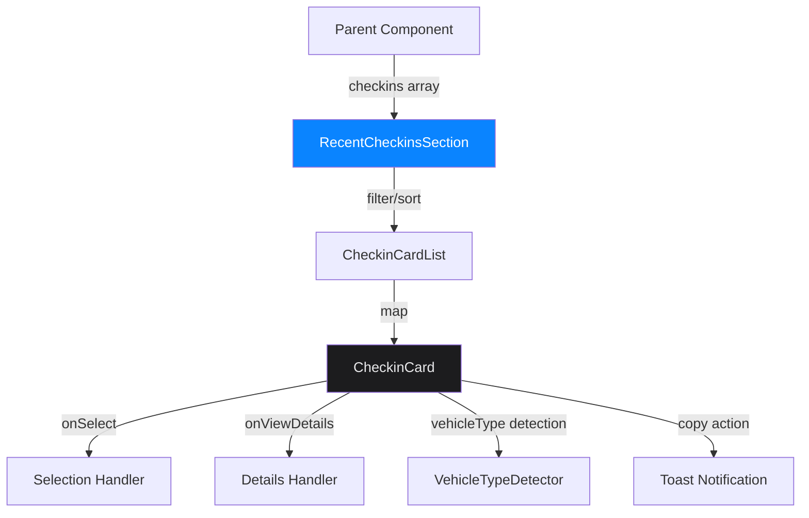

# Design Document - Recent Check-ins Apple Premium UI

## Overview

This design document outlines the technical architecture and implementation approach for a premium, Apple-level "Recent Check-ins" UI component for an automotive workshop management system. The component will embody Apple's Human Interface Guidelines principles while providing a functional, accessible, and visually stunning interface that adapts seamlessly between light and dark themes.

The design leverages existing infrastructure including Framer Motion for animations, Tailwind CSS for styling, React Hot Toast for notifications, and the established theme system with glassmorphism effects.

## Architecture

### Component Hierarchy

```
RecentCheckinsSection (Container)
├── SectionHeader
│   ├── Title
│   ├── Subtitle (optional)
│   └── FilterControls (optional)
├── CheckinCardList
│   └── CheckinCard (repeated)
│       ├── VehicleIconContainer
│       │   └── VehicleTypeIcon
│       ├── InfoColumn
│       │   ├── OwnerNameRow
│       │   │   ├── OwnerName
│       │   │   └── CopyButton
│       │   ├── VehicleInfoRow
│       │   │   ├── VehicleModel
│       │   │   └── LicensePlate
│       │   └── TimestampRow
│       │       ├── ClockIcon
│       │       └── FormattedDate
│       └── ActionColumn
│           ├── StatusBadge
│           └── ActionButton
└── EmptyState (conditional)
```

### Data Flow



### State Management

The component will manage the following state:

1. **Selection State**: Track which check-in card is currently selected
2. **Hover State**: Track hover interactions for microanimations
3. **Filter State**: Optional filtering by status, date range, or vehicle type
4. **Theme State**: Consumed from existing `useTheme` hook

## Components and Interfaces

### 1. RecentCheckinsSection Component

**Purpose**: Main container component that orchestrates the display of recent check-ins.

**Props Interface**:
```typescript
interface RecentCheckinsSectionProps {
  checkins: Checkin[];
  maxItems?: number;
  onSelectCheckin?: (checkin: Checkin) => void;
  onViewDetails?: (checkin: Checkin) => void;
  showFilters?: boolean;
  className?: string;
}
```

**Responsibilities**:
- Receive and validate checkin data
- Apply sorting (most recent first)
- Limit display to maxItems (default: 10)
- Render section header with title
- Render empty state when no data
- Pass handlers to child components

**Styling Approach**:
- Container: `w-full max-w-7xl mx-auto px-4 sm:px-6 lg:px-8`
- Background: Transparent, relies on parent layout
- Spacing: `space-y-4` between cards

### 2. CheckinCard Component

**Purpose**: Individual card displaying a single check-in record with premium Apple aesthetics.

**Props Interface**:
```typescript
interface CheckinCardProps {
  checkin: Checkin;
  isSelected: boolean;
  onSelect: (checkin: Checkin) => void;
  onViewDetails: (checkin: Checkin) => void;
}
```

**Visual Specifications**:

**Dark Mode**:
- Background: `linear-gradient(135deg, #1C1C1E 0%, #2C2C2E 100%)`
- Border: `1px solid rgba(255,255,255,0.08)`
- Shadow (default): `0 4px 20px rgba(0,0,0,0.4)`
- Shadow (hover): `0 8px 32px rgba(0,0,0,0.6)`
- Shadow (selected): `0 8px 32px rgba(0,0,0,0.6), 0 0 0 1px rgba(16,185,129,0.3)`
- Border radius: `16px`
- Padding: `16px`

**Light Mode**:
- Background: `linear-gradient(135deg, #FFFFFF 0%, #F9F9FB 100%)`
- Border: `1px solid rgba(0,0,0,0.06)`
- Shadow (default): `0 2px 12px rgba(0,0,0,0.08)`
- Shadow (hover): `0 4px 20px rgba(0,0,0,0.12)`
- Shadow (selected): `0 4px 20px rgba(0,0,0,0.12), 0 0 0 2px rgba(16,185,129,0.3)`

**Layout Grid**:
```
┌─────────────────────────────────────────────────────────┐
│  [Icon]  [Owner Name]              [Status] [Action]    │
│  48x48   [Vehicle • Plate]                              │
│          [🕐 Date/Time]                                  │
└─────────────────────────────────────────────────────────┘
   16px    16px gap                   8px gap
```

**Responsive Breakpoints**:
- Mobile (<768px): Stack vertically, icon above info
- Tablet (768px-1024px): Horizontal layout, smaller gaps
- Desktop (>1024px): Full horizontal layout with optimal spacing

### 3. VehicleIconContainer Component

**Purpose**: Display vehicle type icon with premium glass effect background.

**Visual Specifications**:
- Container size: `48px × 48px`
- Border radius: `12px`
- Icon size: `24px × 24px`
- Background (active): `linear-gradient(135deg, rgba(59,130,246,0.15), rgba(99,102,241,0.25))`
- Background (completed): `linear-gradient(135deg, rgba(16,185,129,0.15), rgba(5,150,105,0.25))`
- Background (selected): `linear-gradient(135deg, rgba(16,185,129,0.15), rgba(5,150,105,0.25))`
- Border: `1px solid rgba(255,255,255,0.08)`
- Shadow: `0 4px 16px rgba(59,130,246,0.25)` (color matches status)

**Icon Colors**:
- Active: `#60A5FA` (blue-400)
- Completed: `#10B981` (emerald-500)
- Selected: `#10B981` (emerald-500)

### 4. InfoColumn Component

**Purpose**: Display owner name, vehicle information, and timestamp in a hierarchical layout.

**Typography Specifications**:

**Owner Name**:
- Font: SF Pro Display / Inter
- Size: `14px` (0.875rem)
- Weight: `600` (semibold)
- Color (dark): `#FFFFFF`
- Color (light): `#1F2937`
- Line height: `1.5`
- Truncation: `truncate` with ellipsis

**Vehicle Model & Plate**:
- Font: SF Pro Text / Inter
- Size: `12px` (0.75rem)
- Weight: `400` (regular)
- Color (dark): `#9CA3AF` (gray-400)
- Color (light): `#6B7280` (gray-500)
- Plate font: `font-mono`
- Plate color (dark): `#D1D5DB` (gray-300)
- Separator: ` • ` (bullet point)

**Timestamp**:
- Font: SF Pro Text / Inter
- Size: `11px` (0.6875rem)
- Weight: `400` (regular)
- Color (dark): `#6B7280` (gray-500)
- Color (light): `#9CA3AF` (gray-400)
- Icon size: `12px`
- Format: `DD MMM, HH:mm` (e.g., "30 Out, 14:30")

**Layout**:
- Vertical spacing: `4px` between rows
- Flex: `flex-1 min-w-0` (allows truncation)
- Overflow: `hidden` on container

### 5. StatusBadge Component

**Purpose**: Display current check-in status with color-coded pill design.

**Props Interface**:
```typescript
interface StatusBadgeProps {
  status: 'active' | 'completed' | 'pending';
  label: string;
}
```

**Visual Specifications**:

**Active Status** (Em andamento):
- Background: `rgba(245,158,11,0.15)` (amber-500/15)
- Text color: `#FCD34D` (amber-300)
- Border: `1px solid rgba(245,158,11,0.3)`
- Glow: `0 0 12px rgba(245,158,11,0.2)`

**Completed Status** (Concluído):
- Background: `rgba(16,185,129,0.15)` (emerald-500/15)
- Text color: `#6EE7B7` (emerald-300)
- Border: `1px solid rgba(16,185,129,0.3)`
- Glow: `0 0 12px rgba(16,185,129,0.2)`

**Pending Status** (Aguardando):
- Background: `rgba(59,130,246,0.15)` (blue-500/15)
- Text color: `#93C5FD` (blue-300)
- Border: `1px solid rgba(59,130,246,0.3)`
- Glow: `0 0 12px rgba(59,130,246,0.2)`

**Common Properties**:
- Padding: `4px 10px`
- Border radius: `9999px` (full pill)
- Font size: `11px`
- Font weight: `600` (semibold)
- Text transform: `none`
- Letter spacing: `0.01em`

### 6. ActionButton Component

**Purpose**: Trigger detail view with external link icon and hover animation.

**Visual Specifications**:

**Default State**:
- Size: `32px × 32px`
- Border radius: `8px`
- Background (dark): `rgba(59,130,246,0.1)`
- Background (light): `rgba(59,130,246,0.08)`
- Border: `1px solid rgba(59,130,246,0.2)`
- Icon color: `#60A5FA` (blue-400)
- Icon size: `16px`

**Selected State**:
- Background (dark): `rgba(16,185,129,0.15)`
- Background (light): `rgba(16,185,129,0.12)`
- Border: `1px solid rgba(16,185,129,0.3)`
- Icon color: `#10B981` (emerald-500)

**Hover State**:
- Scale: `1.05`
- Background opacity: `+0.05`
- Shadow: `0 4px 12px rgba(59,130,246,0.3)`
- Transition: `200ms cubic-bezier(0.4, 0.0, 0.2, 1)`

**Active/Tap State**:
- Scale: `0.95`
- Transition: `100ms cubic-bezier(0.4, 0.0, 0.2, 1)`

### 7. CopyButton Component

**Purpose**: Copy check-in ID to clipboard with toast feedback.

**Visual Specifications**:
- Size: `20px × 20px`
- Icon size: `12px`
- Color (default): `#6B7280` (gray-500)
- Color (hover): `#10B981` (emerald-500)
- Background: `transparent`
- Hover scale: `1.1`
- Tap scale: `0.9`
- Transition: `150ms ease-out`

**Toast Notification**:
- Background: `#1C1C1E`
- Text color: `#FFFFFF`
- Border: `1px solid rgba(255,255,255,0.1)`
- Border radius: `12px`
- Font size: `14px`
- Font weight: `500`
- Duration: `2000ms`
- Position: `bottom-center`

## Data Models

### Checkin Interface

```typescript
interface Checkin {
  id: string;
  clientName: string;
  vehicleBrand: string;
  vehicleModel: string;
  vehiclePlate: string;
  vehicleType?: 'car' | 'motorcycle' | 'truck' | 'pickup';
  status: 'active' | 'completed' | 'pending';
  createdAt: string | Date;
  updatedAt?: string | Date;
  services?: string[];
  notes?: string;
}
```

### Theme Configuration

```typescript
interface ThemeColors {
  dark: {
    background: string;
    surface: string;
    card: string;
    elevated: string;
    text: string;
    muted: string;
    subtle: string;
    accent: string;
    accentAlt: string;
    border: string;
    glass: string;
    hover: string;
  };
  light: {
    background: string;
    surface: string;
    card: string;
    elevated: string;
    text: string;
    muted: string;
    subtle: string;
    accent: string;
    accentAlt: string;
    border: string;
    glass: string;
    hover: string;
  };
}
```

## Microinteractions and Animations

### Card Animations

**Entry Animation** (Framer Motion):
```javascript
{
  initial: { opacity: 0, y: 20 },
  animate: { opacity: 1, y: 0 },
  transition: { 
    duration: 0.3,
    ease: [0.22, 1, 0.36, 1] // Custom easing curve
  }
}
```

**Hover Animation**:
```javascript
{
  whileHover: {
    scale: 1.01,
    y: -2,
    transition: { 
      duration: 0.2,
      ease: [0.22, 1, 0.36, 1]
    }
  }
}
```

**Stagger Children** (for list):
```javascript
{
  animate: "visible",
  variants: {
    visible: {
      transition: {
        staggerChildren: 0.05
      }
    }
  }
}
```

### Button Animations

**Hover**:
- Scale: `1.05` to `1.1`
- Duration: `150ms`
- Easing: `cubic-bezier(0.4, 0.0, 0.2, 1)`

**Tap**:
- Scale: `0.95`
- Duration: `100ms`
- Easing: `cubic-bezier(0.4, 0.0, 0.2, 1)`

### Icon Animations

**Vehicle Icon Hover**:
- Scale: `1.05`
- Rotation: `2deg` (subtle tilt)
- Duration: `200ms`

**Copy Icon Hover**:
- Scale: `1.1`
- Duration: `150ms`

### Status Badge Glow

**Pulse Animation** (for active status):
```javascript
{
  animate: {
    boxShadow: [
      '0 0 12px rgba(245,158,11,0.2)',
      '0 0 20px rgba(245,158,11,0.4)',
      '0 0 12px rgba(245,158,11,0.2)'
    ]
  },
  transition: {
    duration: 2,
    repeat: Infinity,
    ease: "easeInOut"
  }
}
```

## Error Handling

### Data Validation

1. **Empty Checkins Array**:
   - Display EmptyState component
   - Show friendly message: "Nenhum check-in recente"
   - Include icon (Car with slash or empty box)
   - Suggest action: "Realize um novo check-in"

2. **Missing Required Fields**:
   - Fallback to default values
   - `clientName`: "Cliente não identificado"
   - `vehicleModel`: "Veículo não especificado"
   - `vehiclePlate`: "---"
   - `createdAt`: Current date/time

3. **Invalid Date Format**:
   - Try parsing with `new Date()`
   - Fallback to "Data inválida"
   - Log warning to console

4. **Vehicle Type Detection Failure**:
   - Default to `'car'` icon
   - Log detection attempt for debugging

### Error Boundaries

Wrap component in ErrorBoundary:
```javascript
<ErrorBoundary fallback={<ErrorFallback />}>
  <RecentCheckinsSection {...props} />
</ErrorBoundary>
```

**ErrorFallback Component**:
- Display friendly error message
- Show reload button
- Log error details to monitoring service

### Network Errors

If checkins are loaded from API:
- Show loading skeleton during fetch
- Display error state on failure
- Provide retry button
- Cache last successful data

## Testing Strategy

### Unit Tests

**CheckinCard Component**:
1. Renders with all required props
2. Displays correct vehicle icon based on type
3. Formats date correctly in Portuguese
4. Applies correct status badge color
5. Truncates long text properly
6. Calls onSelect when clicked
7. Calls onViewDetails when action button clicked
8. Copies ID to clipboard on copy button click
9. Shows toast notification after copy

**StatusBadge Component**:
1. Renders correct color for each status
2. Displays correct label text
3. Applies glow effect for active status

**VehicleIconContainer Component**:
1. Renders correct icon for each vehicle type
2. Applies correct background gradient
3. Scales on hover

### Integration Tests

**RecentCheckinsSection**:
1. Renders list of checkin cards
2. Limits display to maxItems
3. Sorts by most recent first
4. Shows empty state when no data
5. Handles selection state correctly
6. Passes handlers to child components

### Visual Regression Tests

1. Card appearance in dark mode
2. Card appearance in light mode
3. Hover states
4. Selected states
5. Different status badges
6. Different vehicle types
7. Responsive layouts (mobile, tablet, desktop)

### Accessibility Tests

1. Keyboard navigation works
2. Focus indicators visible
3. ARIA labels present
4. Color contrast meets WCAG AA (4.5:1)
5. Screen reader announces status changes
6. Touch targets minimum 44px × 44px

### Performance Tests

1. Renders 100 cards without lag
2. Animations run at 60fps
3. No memory leaks on mount/unmount
4. Efficient re-renders (React.memo)

## Accessibility Considerations

### Semantic HTML

- Use `<article>` for each CheckinCard
- Use `<button>` for interactive elements
- Use `<time>` element for timestamps with `datetime` attribute

### ARIA Attributes

**CheckinCard**:
```html
<article 
  role="button"
  aria-label="Check-in de [Cliente] - [Veículo] - [Status]"
  aria-pressed={isSelected}
  tabIndex={0}
>
```

**StatusBadge**:
```html
<span 
  role="status"
  aria-label="Status: [status text]"
>
```

**ActionButton**:
```html
<button
  aria-label="Ver detalhes do check-in"
  title="Ver detalhes"
>
```

**CopyButton**:
```html
<button
  aria-label="Copiar ID do check-in"
  title="Copiar ID"
>
```

### Keyboard Navigation

- Tab: Navigate between cards
- Enter/Space: Select card
- Tab: Navigate to action button
- Enter/Space: Trigger action
- Escape: Deselect card

### Focus Management

- Visible focus ring: `ring-2 ring-blue-500 ring-offset-2`
- Focus trap in modal (if details view is modal)
- Return focus after action

### Color Contrast

All text meets WCAG AA standards:
- White text on dark backgrounds: 15:1 ratio
- Dark text on light backgrounds: 12:1 ratio
- Status badge text: Minimum 4.5:1 ratio
- Icon colors: Minimum 3:1 ratio (large elements)

### Screen Reader Support

- Announce status changes
- Announce selection state
- Announce toast notifications
- Provide context for icons

## Performance Optimizations

### React Optimizations

1. **Memoization**:
   ```javascript
   const CheckinCard = React.memo(CheckinCardComponent, (prev, next) => {
     return prev.checkin.id === next.checkin.id &&
            prev.isSelected === next.isSelected;
   });
   ```

2. **Virtualization** (for large lists):
   - Use `react-window` or `react-virtual`
   - Render only visible cards
   - Maintain scroll position

3. **Lazy Loading**:
   - Load images lazily
   - Defer non-critical animations

### CSS Optimizations

1. **GPU Acceleration**:
   ```css
   .checkin-card {
     transform: translateZ(0);
     backface-visibility: hidden;
     perspective: 1000px;
   }
   ```

2. **Will-change**:
   ```css
   .checkin-card:hover {
     will-change: transform, box-shadow;
   }
   ```

3. **Contain**:
   ```css
   .checkin-card {
     contain: layout style paint;
   }
   ```

### Animation Optimizations

1. Use `transform` and `opacity` only (GPU-accelerated)
2. Avoid animating `width`, `height`, `top`, `left`
3. Use `requestAnimationFrame` for custom animations
4. Reduce motion for users with `prefers-reduced-motion`

### Bundle Size

1. Tree-shake unused Framer Motion features
2. Use dynamic imports for heavy components
3. Optimize icon imports (import specific icons only)

## Implementation Phases

### Phase 1: Core Structure (Requirements 1, 2, 10)
- Create RecentCheckinsSection container
- Implement CheckinCard layout
- Set up responsive grid
- Implement text truncation
- Add basic styling

### Phase 2: Visual Design (Requirements 6, 9)
- Implement dark/light theme support
- Add glassmorphism effects
- Apply shadows and depth
- Implement gradient backgrounds
- Add border styling

### Phase 3: Typography (Requirement 8)
- Apply SF Pro font family
- Set font sizes and weights
- Implement line heights
- Add text colors for themes

### Phase 4: Icons and Status (Requirements 3, 4)
- Integrate VehicleTypeIcon component
- Create StatusBadge component
- Apply icon backgrounds
- Add status colors and glow

### Phase 5: Interactions (Requirements 5, 7)
- Implement hover animations
- Add click handlers
- Create ActionButton component
- Implement CopyButton with toast
- Add keyboard navigation

### Phase 6: Polish and Optimization
- Add entry animations
- Implement stagger effect
- Optimize performance
- Add error boundaries
- Implement loading states

### Phase 7: Testing and Accessibility
- Write unit tests
- Add integration tests
- Implement accessibility features
- Test keyboard navigation
- Verify color contrast

## Dependencies

### Required Packages
- `react` (^18.0.0)
- `framer-motion` (^10.0.0 or latest)
- `react-hot-toast` (^2.4.0 or latest)
- `lucide-react` (for icons)
- `tailwindcss` (^3.0.0)

### Existing Services
- `vehicleTypeDetector.js` - Vehicle type detection logic
- `useTheme.js` - Theme management hook
- `vehicleIcons.jsx` - Vehicle icon components

### Optional Enhancements
- `react-window` - For virtualization (if >100 items)
- `date-fns` - For advanced date formatting
- `clsx` or `classnames` - For conditional class management

## Design Decisions and Rationale

### 1. Why Framer Motion?
- Already used in existing RegistroCard component
- Provides declarative animation API
- Excellent performance with GPU acceleration
- Built-in gesture support (hover, tap, drag)
- Small bundle size impact

### 2. Why Glassmorphism?
- Aligns with Apple's design language (iOS, macOS)
- Creates depth without heavy shadows
- Works beautifully in dark mode
- Provides visual hierarchy
- Modern and premium feel

### 3. Why Horizontal Card Layout?
- Maximizes information density
- Easier to scan horizontally
- Better for desktop/tablet viewports
- Aligns with dashboard patterns
- Allows for action buttons on right

### 4. Why Pill-shaped Status Badges?
- Apple's preferred badge style
- Clear visual distinction
- Compact and space-efficient
- Easy to color-code
- Familiar to users

### 5. Why Truncate Text?
- Prevents horizontal overflow
- Maintains card dimensions
- Improves visual consistency
- Users can click for full details
- Better responsive behavior

### 6. Why Stagger Animation?
- Creates sense of flow
- Draws attention to content
- Feels more organic
- Reduces cognitive load
- Premium interaction feel

## Future Enhancements

### Phase 2 Features
1. **Filtering**: Filter by status, date range, vehicle type
2. **Sorting**: Sort by date, client name, status
3. **Search**: Quick search by client name or plate
4. **Bulk Actions**: Select multiple cards for batch operations
5. **Drag to Reorder**: Manual priority ordering
6. **Quick Actions Menu**: Right-click context menu
7. **Keyboard Shortcuts**: Power user features
8. **Export**: Export list to PDF or CSV

### Advanced Features
1. **Real-time Updates**: WebSocket integration for live data
2. **Optimistic UI**: Instant feedback before server confirmation
3. **Offline Support**: Cache data for offline viewing
4. **Animations**: More sophisticated transitions
5. **Customization**: User preferences for card density
6. **Analytics**: Track interaction patterns
7. **A/B Testing**: Test different layouts
8. **Internationalization**: Support multiple languages

## Conclusion

This design provides a comprehensive blueprint for implementing a premium, Apple-level Recent Check-ins UI component. The architecture is modular, scalable, and maintainable. The visual design follows Apple's Human Interface Guidelines while adapting to the specific needs of an automotive workshop management system.

The component will integrate seamlessly with existing infrastructure, leverage proven libraries, and provide an exceptional user experience across all devices and themes. The phased implementation approach ensures steady progress with testable milestones, while the detailed specifications provide clear guidance for developers.
