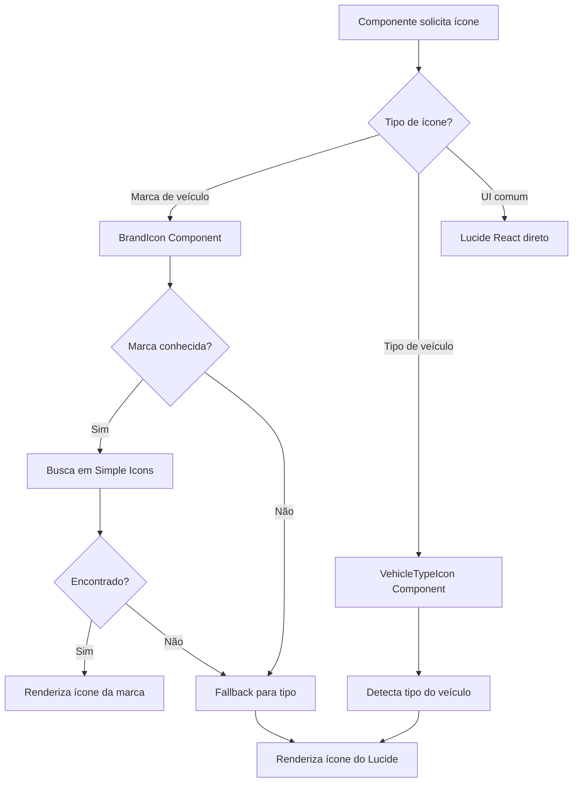

# Design Document - Sistema de Ícones Premium

## Overview

O sistema de ícones premium substituirá a implementação atual por uma solução robusta e escalável que utiliza as melhores bibliotecas de ícones disponíveis no ecossistema React. A arquitetura priorizará performance, manutenibilidade e experiência visual de alta qualidade.

### Bibliotecas Selecionadas

**Lucide React** (Primária)
- Ícones modernos e minimalistas
- Otimizados para performance (tree-shakeable)
- Consistência visual excepcional
- Suporte nativo a SVG
- Já instalado no projeto

**React Icons** (Secundária)
- Acesso a múltiplas coleções (Font Awesome, Simple Icons, etc.)
- Ícones de marcas através do Simple Icons
- Fallback para ícones não disponíveis no Lucide
- Já instalado no projeto

## Architecture

### Estrutura de Componentes

```
src/
├── utils/
│   ├── icons/
│   │   ├── index.js              # Exportações centralizadas
│   │   ├── vehicleIcons.jsx      # Ícones de tipos de veículos
│   │   ├── brandIcons.jsx        # Ícones de marcas (refatorado)
│   │   └── commonIcons.jsx       # Ícones comuns da UI
│   └── vehicleHelpers.js         # Funções auxiliares
├── components/
│   ├── VehicleCard.jsx           # Atualizado com novos ícones
│   └── ModalSelecaoVeiculo.jsx   # Atualizado com novos ícones
```

### Fluxo de Seleção de Ícones



## Components and Interfaces

### 1. VehicleTypeIcon Component

Componente responsável por renderizar ícones genéricos de tipos de veículos.

```jsx
interface VehicleTypeIconProps {
  type: 'car' | 'motorcycle' | 'truck';
  className?: string;
  size?: number;
}

export const VehicleTypeIcon: React.FC<VehicleTypeIconProps>
```

**Implementação:**
- Usa Lucide React: `Car`, `Bike`, `Truck`
- Suporta customização via className
- Tamanho padrão: 24px
- Cores adaptáveis ao tema

### 2. BrandIcon Component (Refatorado)

Componente inteligente que renderiza ícones de marcas de veículos.

```jsx
interface BrandIconProps {
  vehicleModel: string;
  className?: string;
  size?: number;
  showFallback?: boolean;
}

export const BrandIcon: React.FC<BrandIconProps>
```

**Lógica de Renderização:**

1. **Extração da Marca:**
   - Parse do `vehicleModel` string
   - Normalização (uppercase, trim)
   - Matching contra dicionário de marcas

2. **Busca do Ícone:**
   - Primeiro: Simple Icons (via React Icons)
   - Exemplo: `SiHonda`, `SiToyota`, `SiYamaha`
   - Fallback: VehicleTypeIcon baseado no tipo detectado

3. **Mapeamento de Marcas:**

```javascript
const brandIconMap = {
  // Carros
  'HONDA': SiHonda,
  'TOYOTA': SiToyota,
  'FORD': SiFord,
  'CHEVROLET': SiChevrolet,
  'VOLKSWAGEN': SiVolkswagen,
  'BMW': SiBmw,
  'MERCEDES': SiMercedes,
  'MERCEDES-BENZ': SiMercedes,
  'AUDI': SiAudi,
  'HYUNDAI': SiHyundai,
  'KIA': SiKia,
  'NISSAN': SiNissan,
  'FIAT': SiFiat,
  'TESLA': SiTesla,
  'PORSCHE': SiPorsche,
  'FERRARI': SiFerrari,
  'LAMBORGHINI': SiLamborghini,
  
  // Motos
  'YAMAHA': SiYamaha,
  'SUZUKI': SiSuzuki,
  'KAWASAKI': SiKawasaki,
  'DUCATI': SiDucati,
  'HARLEY': SiHarleydavidson,
  'HARLEY-DAVIDSON': SiHarleydavidson,
  'TRIUMPH': SiTriumph,
  'KTM': SiKtm,
  
  // Adicionar mais conforme necessário
};
```

### 3. CommonIcons Utility

Exportações centralizadas de ícones comuns do Lucide React.

```javascript
export {
  Car,
  Bike,
  Truck,
  Clock,
  Calendar,
  User,
  Users,
  Phone,
  Mail,
  MapPin,
  Search,
  Plus,
  X,
  Check,
  ChevronDown,
  ChevronUp,
  ChevronLeft,
  ChevronRight,
  Settings,
  LogOut,
  Menu,
  // ... outros ícones comuns
} from 'lucide-react';
```

### 4. VehicleCard Component (Atualizado)

```jsx
import { VehicleTypeIcon } from '@/utils/icons/vehicleIcons';
import { BrandIcon } from '@/utils/icons/brandIcons';
import { Clock } from '@/utils/icons/commonIcons';

const VehicleCard = ({ vehicle, onClick, showCheckInTime }) => {
  return (
    <button className="vehicle-card">
      {/* Ícone com prioridade para marca */}
      <div className="icon-container">
        <BrandIcon 
          vehicleModel={vehicle.model}
          className="w-12 h-12"
          showFallback={true}
        />
      </div>
      
      {/* Resto do componente */}
    </button>
  );
};
```

## Data Models

### Brand Detection Data

```javascript
// Estrutura para detecção de marcas
const brandDetectionConfig = {
  brands: [
    {
      name: 'HONDA',
      aliases: ['HONDA', 'HONDA MOTOR'],
      icon: SiHonda,
      type: 'both' // car and motorcycle
    },
    {
      name: 'YAMAHA',
      aliases: ['YAMAHA', 'YAMAHA MOTOR'],
      icon: SiYamaha,
      type: 'motorcycle'
    },
    // ... mais marcas
  ],
  
  // Palavras-chave para detecção de tipo
  typeKeywords: {
    motorcycle: ['MOTO', 'CB', 'CBR', 'XJ', 'YZF', 'NINJA', 'MT', 'R1', 'R6'],
    truck: ['CAMINHÃO', 'TRUCK', 'CARGO', 'ATEGO', 'AXOR'],
    car: [] // default
  }
};
```

### Icon Component Props

```typescript
interface IconBaseProps {
  className?: string;
  size?: number;
  color?: string;
  strokeWidth?: number;
}

interface BrandIconResult {
  icon: React.ComponentType;
  source: 'brand' | 'fallback';
  brandName?: string;
}
```

## Error Handling

### 1. Ícone Não Encontrado

```javascript
const BrandIcon = ({ vehicleModel, showFallback = true }) => {
  try {
    const brandInfo = extractBrand(vehicleModel);
    const IconComponent = brandIconMap[brandInfo?.name];
    
    if (IconComponent) {
      return <IconComponent className={className} />;
    }
    
    if (showFallback) {
      const vehicleType = detectVehicleType(vehicleModel);
      return <VehicleTypeIcon type={vehicleType} className={className} />;
    }
    
    return null;
  } catch (error) {
    console.warn('Erro ao renderizar ícone:', error);
    return showFallback ? <VehicleTypeIcon type="car" className={className} /> : null;
  }
};
```

### 2. Logging e Debug

```javascript
// Modo de debug para desenvolvimento
const DEBUG_ICONS = process.env.NODE_ENV === 'development';

const logIconUsage = (vehicleModel, result) => {
  if (DEBUG_ICONS) {
    console.log('[Icon System]', {
      model: vehicleModel,
      brand: result.brandName,
      source: result.source,
      timestamp: new Date().toISOString()
    });
  }
};
```

### 3. Fallback Hierarchy

1. **Nível 1:** Ícone específico da marca (Simple Icons)
2. **Nível 2:** Ícone do tipo de veículo (Lucide React)
3. **Nível 3:** Ícone genérico de carro (último recurso)

## Testing Strategy

### 1. Unit Tests

```javascript
describe('BrandIcon Component', () => {
  it('should render Honda icon for Honda Civic', () => {
    const { container } = render(<BrandIcon vehicleModel="HONDA CIVIC 2020" />);
    expect(container.querySelector('svg')).toBeInTheDocument();
  });
  
  it('should render fallback for unknown brand', () => {
    const { container } = render(<BrandIcon vehicleModel="MARCA DESCONHECIDA" />);
    // Verifica se renderizou ícone de carro genérico
  });
  
  it('should detect motorcycle type correctly', () => {
    const type = detectVehicleType('YAMAHA FAZER 250');
    expect(type).toBe('motorcycle');
  });
});
```

### 2. Visual Regression Tests

- Capturar screenshots de VehicleCards com diferentes marcas
- Verificar consistência de tamanhos e espaçamentos
- Testar em tema claro e escuro

### 3. Performance Tests

```javascript
describe('Icon Performance', () => {
  it('should load icons in less than 100ms', async () => {
    const start = performance.now();
    render(<BrandIcon vehicleModel="HONDA CIVIC" />);
    const end = performance.now();
    expect(end - start).toBeLessThan(100);
  });
  
  it('should not exceed bundle size limit', () => {
    // Verificar tamanho do bundle de ícones
  });
});
```

### 4. Integration Tests

- Testar VehicleCard com diferentes tipos de veículos
- Verificar animações de hover
- Testar modal de seleção com múltiplos veículos

## Performance Considerations

### 1. Tree Shaking

```javascript
// ✅ Correto - importação específica
import { Car, Bike, Truck } from 'lucide-react';

// ❌ Evitar - importação global
import * as LucideIcons from 'lucide-react';
```

### 2. Lazy Loading

```javascript
// Para ícones de marcas raramente usadas
const LazyBrandIcon = lazy(() => import('./icons/rare-brands'));
```

### 3. Memoization

```javascript
const BrandIcon = memo(({ vehicleModel, className }) => {
  const iconComponent = useMemo(
    () => getBrandIcon(vehicleModel),
    [vehicleModel]
  );
  
  return iconComponent;
});
```

### 4. Bundle Analysis

- Monitorar tamanho do bundle de ícones
- Objetivo: < 50KB para todos os ícones
- Usar `vite-bundle-visualizer` para análise

## Accessibility

### 1. ARIA Labels

```jsx
<BrandIcon 
  vehicleModel="HONDA CIVIC"
  aria-label="Ícone da marca Honda"
  role="img"
/>
```

### 2. Semantic HTML

```jsx
<div className="icon-container" role="img" aria-label={`Veículo ${vehicle.model}`}>
  <BrandIcon vehicleModel={vehicle.model} />
</div>
```

### 3. Color Contrast

- Garantir contraste mínimo de 4.5:1
- Testar em modo claro e escuro
- Usar cores do Tailwind que atendem WCAG AA

## Migration Plan

### Fase 1: Preparação
1. Instalar dependências (já instaladas)
2. Criar estrutura de arquivos
3. Implementar utilitários base

### Fase 2: Implementação Core
1. Criar VehicleTypeIcon component
2. Refatorar BrandIcon component
3. Criar commonIcons utility

### Fase 3: Integração
1. Atualizar VehicleCard
2. Atualizar ModalSelecaoVeiculo
3. Atualizar outros componentes que usam ícones

### Fase 4: Testes e Refinamento
1. Testes unitários
2. Testes visuais
3. Ajustes de performance
4. Documentação

## Design Decisions

### Por que Lucide React como primária?

1. **Qualidade Visual:** Ícones modernos e consistentes
2. **Performance:** Tree-shakeable, apenas ícones usados são incluídos
3. **Manutenção:** Ativamente mantido, atualizações frequentes
4. **Tamanho:** Ícones otimizados, pequeno footprint
5. **Flexibilidade:** Fácil customização via props

### Por que Simple Icons (via React Icons) para marcas?

1. **Cobertura:** Maior coleção de logos de marcas
2. **Autenticidade:** Logos oficiais das marcas
3. **Atualização:** Mantido pela comunidade
4. **Consistência:** Todos em formato SVG monocromático

### Por que não usar @cardog-icons/react?

1. **Problemas Atuais:** Ícones não aparecem conforme relatado
2. **Manutenção:** Biblioteca menos conhecida, manutenção incerta
3. **Documentação:** Falta de documentação clara
4. **Alternativas Melhores:** Lucide e React Icons são mais robustos

## Visual Examples

### Antes (Problema Atual)
- Ícones genéricos SVG customizados
- Ícones de marca não aparecem
- Qualidade visual inconsistente

### Depois (Solução Proposta)
- Ícones profissionais do Lucide React
- Logos de marcas do Simple Icons
- Animações suaves e responsivas
- Fallbacks inteligentes
- Consistência visual em toda aplicação
