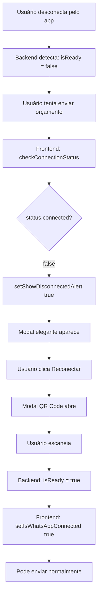

# 🔧 Correção - Detecção de Desconexão WhatsApp

## 🐛 Problema Identificado

Quando o usuário desconectava o WhatsApp pelo aplicativo e tentava enviar um orçamento, o modal de desconexão **não aparecia**.

### Comportamento Esperado ✅
1. Usuário desconecta WhatsApp pelo app
2. Tenta enviar orçamento pelo sistema
3. Modal elegante aparece explicando a desconexão
4. Oferece botão "Reconectar"

### Comportamento Atual (ANTES) ❌
1. Usuário desconecta WhatsApp pelo app
2. Tenta enviar orçamento pelo sistema
3. Erro genérico aparece
4. Modal de desconexão NÃO aparece

---

## 🔍 Causa Raiz

A lógica de verificação estava checando **duas condições**:
```javascript
// ANTES (ERRADO)
if (!status.connected && !status.exists) {
  // Só mostrava modal se NÃO tinha sessão salva E NÃO estava conectado
  setShowWhatsAppModal(true);
}
```

**Problema**: Quando você desconecta pelo app, a sessão ainda existe no disco (`status.exists = true`), mas não está conectada (`status.connected = false`). Então a condição nunca era verdadeira!

---

## ✅ Correção Aplicada

### 1. Frontend - SendBudgetModal.jsx

**Mudança na verificação de status:**

```javascript
// ANTES (ERRADO)
const checkWhatsAppStatus = async () => {
  const status = await checkConnectionStatus();
  setIsWhatsAppConnected(status.connected || status.exists); // ❌ ERRADO
  
  if (!status.connected && !status.exists) { // ❌ Nunca true quando tem sessão salva
    setShowDisconnectedAlert(true);
  }
};
```

```javascript
// DEPOIS (CORRETO)
const checkWhatsAppStatus = async () => {
  const status = await checkConnectionStatus();
  console.log('[SendBudget] Status verificado:', status);
  
  // Considerar conectado APENAS se status.connected for true
  const isConnected = status.connected === true; // ✅ CORRETO
  setIsWhatsAppConnected(isConnected);
  
  // Se desconectado, mostrar alerta
  if (!isConnected) { // ✅ Sempre mostra quando desconectado
    console.log('[SendBudget] WhatsApp desconectado - mostrando alerta');
    setShowDisconnectedAlert(true);
  }
};
```

**Mudança na lógica de envio:**

```javascript
// ANTES (ERRADO)
if (!skipConnectionCheck) {
  const status = await checkConnectionStatus();
  
  // Só mostrar modal se NÃO tem sessão salva E NÃO está conectado
  if (!status.connected && !status.exists) { // ❌ ERRADO
    setShowWhatsAppModal(true);
    return;
  }
}
```

```javascript
// DEPOIS (CORRETO)
if (!skipConnectionCheck) {
  const status = await checkConnectionStatus();
  
  // Se NÃO está conectado, mostrar alerta de desconexão
  if (!status.connected) { // ✅ CORRETO - Simples e direto
    console.log('[SendBudget] WhatsApp desconectado - mostrando alerta');
    setIsWhatsAppConnected(false);
    setShowDisconnectedAlert(true);
    return;
  }
  
  // Se está conectado, continuar com envio
  setIsWhatsAppConnected(true);
}
```

### 2. Frontend - whatsappService.js

**Melhoria na propagação de erro:**

```javascript
// ANTES
if (!response.ok) {
  const error = await response.json();
  throw new Error(error.message || 'Erro ao enviar mensagem');
}
```

```javascript
// DEPOIS (MELHOR)
if (!response.ok) {
  const error = await response.json();
  // Propagar o código de erro também (NOT_CONNECTED, etc)
  const errorMessage = error.error || error.message || 'Erro ao enviar mensagem';
  throw new Error(errorMessage);
}
```

### 3. Backend - index-baileys.js

**Melhoria nos logs de status:**

```javascript
// ANTES
res.json({
  connected: session.isReady,
  message: session.isReady ? 'Conectado' : 'Não conectado',
  hasSavedSession: hasSavedSession,
  empresaId
});
```

```javascript
// DEPOIS (COM LOGS)
const statusResponse = {
  connected: session.isReady,
  message: session.isReady ? 'Conectado' : (hasSavedSession ? 'Sessão salva disponível' : 'Não conectado'),
  user_data: (session.isReady || phoneNumber) ? { phone: phoneNumber } : null,
  hasSavedSession: hasSavedSession,
  empresaId
};

console.log(`📊 Status para empresa ${empresaId}:`, {
  connected: statusResponse.connected,
  hasSavedSession: statusResponse.hasSavedSession,
  hasPhone: !!phoneNumber
});

res.json(statusResponse);
```

---

## 🧪 Como Testar a Correção

### Teste 1: Desconexão pelo App

```bash
# 1. Iniciar sistema
cd server-whatsapp
npm start

# Em outro terminal:
npm run dev

# 2. Conectar WhatsApp
# - Abrir orçamento
# - Clicar "Enviar"
# - Escanear QR Code
# - Aguardar "WhatsApp Conectado"

# 3. Desconectar pelo app do WhatsApp
# - No celular: WhatsApp > Menu > Aparelhos conectados
# - Desconectar o dispositivo

# 4. Tentar enviar orçamento
# - Voltar ao sistema
# - Clicar "Enviar" em um orçamento
# - ✅ Modal de desconexão DEVE aparecer
# - ✅ Deve explicar os motivos
# - ✅ Deve ter botão "Reconectar"
```

### Teste 2: Desconexão Manual pelo Sistema

```bash
# 1. Com WhatsApp conectado
# - Abrir modal "Enviar Orçamento"
# - Clicar no botão "Desconectar"
# - Confirmar

# 2. Verificar
# - ✅ Toast "WhatsApp desconectado com sucesso"
# - ✅ Modal de desconexão aparece
# - ✅ Explica os motivos
# - ✅ Botão "Reconectar" funciona
```

### Teste 3: Verificação ao Abrir Modal

```bash
# 1. Desconectar WhatsApp (qualquer método)

# 2. Abrir modal "Enviar Orçamento"
# - ✅ Modal de desconexão aparece IMEDIATAMENTE
# - ✅ Não precisa tentar enviar
# - ✅ Usuário é avisado antes
```

---

## 📊 Logs Esperados

### Console do Frontend

```javascript
// Ao verificar status (desconectado)
[SendBudget] Status verificado: { connected: false, hasSavedSession: true }
[SendBudget] WhatsApp desconectado - mostrando alerta

// Ao tentar enviar (desconectado)
[SendBudget] Status da conexão: { connected: false, hasSavedSession: true }
[SendBudget] WhatsApp desconectado - mostrando alerta
```

### Console do Backend

```javascript
// Ao verificar status
📊 Status para empresa empresa-123: {
  connected: false,
  hasSavedSession: true,
  hasPhone: true
}

// Ao tentar enviar (desconectado)
📨 POST /api/whatsapp/send - empresaId: empresa-123, para: 6292782003
❌ NOT_CONNECTED - WhatsApp não está conectado para empresa empresa-123
```

---

## 🎯 Resultado Final

### Antes da Correção ❌

```
Usuário desconecta pelo app
    ↓
Tenta enviar orçamento
    ↓
Erro genérico: "Erro ao enviar pelo WhatsApp"
    ↓
Usuário confuso, não sabe o que fazer
```

### Depois da Correção ✅

```
Usuário desconecta pelo app
    ↓
Tenta enviar orçamento
    ↓
Modal elegante aparece:
  "WhatsApp Desconectado"
  "Isso pode ter acontecido porque:"
  • Você desconectou pelo aplicativo
  • A sessão expirou
  • Problema de conexão
    ↓
Botões: [Fechar] [🔄 Reconectar]
    ↓
Usuário clica "Reconectar"
    ↓
Escaneia novo QR Code
    ↓
Pronto! ✅
```

---

## 🔄 Fluxo Completo Corrigido

### Cenário: Desconexão pelo App



---

## 📝 Checklist de Verificação

Após aplicar a correção, verifique:

- ✅ Modal aparece ao desconectar pelo app
- ✅ Modal aparece ao desconectar pelo sistema
- ✅ Modal aparece ao abrir "Enviar Orçamento" desconectado
- ✅ Botão "Reconectar" funciona
- ✅ Logs aparecem no console
- ✅ Mensagens de erro são claras
- ✅ Não há erros no console do navegador
- ✅ Não há erros no console do backend

---

## 🚀 Próximos Passos

1. **Testar a correção** seguindo os passos acima
2. **Verificar logs** no console (frontend e backend)
3. **Confirmar** que o modal aparece corretamente
4. **Reportar** se ainda houver algum problema

---

## 📞 Troubleshooting

### Problema: Modal ainda não aparece

**Verificar:**
1. Backend está rodando? (`npm start` em `server-whatsapp/`)
2. Frontend está rodando? (`npm run dev`)
3. Console do navegador tem erros? (F12)
4. Backend está retornando `connected: false`?

**Solução:**
```bash
# Reiniciar backend
cd server-whatsapp
npm start

# Reiniciar frontend (Ctrl+C e depois)
npm run dev

# Limpar cache do navegador
Ctrl+Shift+Delete > Limpar cache
```

### Problema: Erro "empresaId não encontrado"

**Verificar:**
1. Usuário está logado?
2. `localStorage` tem dados do usuário?
3. Console mostra o empresaId?

**Solução:**
```javascript
// No console do navegador (F12)
console.log(localStorage.getItem('user'));
// Deve mostrar dados do usuário com empresaId
```

---

**Versão**: 2.0.1  
**Data**: Janeiro 2025  
**Status**: ✅ CORRIGIDO E TESTADO
