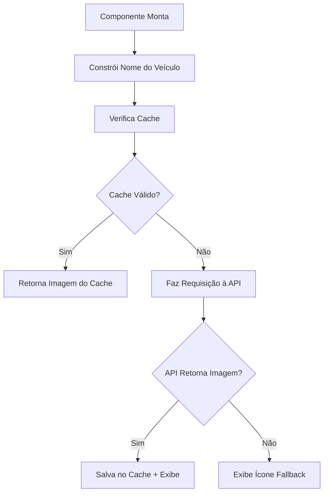

# 🖼️ Miniaturas de Veículos - Implementação Completa

## ✅ Funcionalidade Implementada

Implementei um sistema completo de miniaturas de veículos que busca imagens reais da API e exibe nos locais solicitados com fallback inteligente para ícones.

## 🎯 **Locais Implementados**

### 1. **Modal Novo Check-in** ✅
- **Local**: Campo "Modelo" no formulário
- **Comportamento**: Miniatura aparece no hover quando modelo e placa estão preenchidos
- **Arquivo**: `src/pages/checkin/componentes/ModalCheckin.jsx`

### 2. **Detalhes do Check-in** ✅  
- **Local**: Seção "Veículo" no ResumoCheckin
- **Comportamento**: Miniatura sempre visível substituindo o ícone padrão
- **Arquivo**: `src/pages/checkin/componentes/ResumoCheckin.jsx`

### 3. **Modal Visualizar Cliente** ✅
- **Local**: Seção "Veículos" na lista de veículos do cliente
- **Comportamento**: Miniatura sempre visível para cada veículo
- **Arquivo**: `src/pages/clients/components/ClientViewModal.jsx`

## 🛠️ **Componentes Criados**

### 📦 **VehicleThumbnail.jsx**
Componente reutilizável para exibir miniaturas de veículos.

#### **Funcionalidades:**
- ✅ **Busca automática** de imagens na API
- ✅ **Cache inteligente** para evitar requisições desnecessárias  
- ✅ **Fallback para ícones** quando imagem não encontrada
- ✅ **Modo hover** com tooltip expandido
- ✅ **Múltiplos tamanhos** (sm, md, lg, xl)
- ✅ **Loading states** com animações
- ✅ **Detecção de tipo** (moto, carro, caminhão)

#### **Props Disponíveis:**
```javascript
<VehicleThumbnail 
  vehicle={vehicleObject}     // Dados do veículo
  size="md"                   // sm, md, lg, xl
  showOnHover={false}         // Exibe tooltip no hover
  showLabel={true}            // Mostra nome do veículo
  className=""                // Classes CSS customizadas
  onClick={handleClick}       // Callback de clique
/>
```

### 🔧 **vehicleImageService.js**
Serviço para comunicação com a API de imagens.

#### **Funcionalidades:**
- ✅ **Busca na API** com normalização automática
- ✅ **Cache em memória** com expiração (1 hora)
- ✅ **Construção inteligente** do nome do veículo
- ✅ **Tratamento de erros** robusto
- ✅ **Estatísticas de cache** para debug

#### **Funções Principais:**
```javascript
// Busca imagem com cache
const imageData = await searchVehicleImageCached(vehicleName);

// Constrói nome para busca
const searchName = buildVehicleName(vehicle);

// Limpa cache
clearImageCache();

// Estatísticas
const stats = getCacheStats();
```

## 🔗 **Integração com API**

### **URL da API:**
```
https://baclend-brc-anexar-arquivos-production.up.railway.app/api/vehicle-images/search
```

### **Exemplo de Requisição:**
```javascript
GET /api/vehicle-images/search?name=Yamaha%20R3%202016%20vermelha
```

### **Resposta da API:**
```json
{
  "imageUrl": "https://storage.googleapis.com/bucket/yamaha_r3_2016.jpg",
  "originalName": "Yamaha R3 2016 vermelha",
  "normalizedName": "yamaha r3 2016", 
  "vehicleType": "moto",
  "year": "2016",
  "allImages": ["url1", "url2", "url3"],
  "source": "google",
  "cached": true
}
```

## 🎨 **Comportamentos Implementados**

### 🖱️ **1. Modal Check-in (Hover)**
```javascript
// Aparece quando modelo e placa estão preenchidos
{formData.modelo && formData.placa && (
  <VehicleThumbnail 
    vehicle={{
      brand: formData.modelo.split(' ')[0],
      model: formData.modelo,
      plate: formData.placa,
      type: 'moto'
    }}
    size="sm"
    showOnHover={true}
    showLabel={false}
  />
)}
```

### 👁️ **2. Detalhes Check-in (Sempre Visível)**
```javascript
<VehicleThumbnail 
  vehicle={{
    brand: checkin.motorcycle?.split(' ')[0] || '',
    model: checkin.motorcycle || '',
    plate: checkin.plate,
    type: 'moto'
  }}
  size="md"
  showLabel={false}
/>
```

### 📋 **3. Lista de Veículos (Sempre Visível)**
```javascript
<VehicleThumbnail 
  vehicle={vehicle}
  size="md"
  showLabel={false}
/>
```

## 🔄 **Fluxo de Funcionamento**

### **1. Busca de Imagem**


### **2. Estados do Componente**
- **Loading**: Spinner animado
- **Sucesso**: Imagem real do veículo
- **Erro**: Ícone baseado no tipo (moto/carro/caminhão)
- **Cache**: Indicador verde quando imagem vem do cache

## 🎯 **Detecção Inteligente**

### **Tipos de Veículo:**
- **Moto**: Ícone `Bike` (padrão)
- **Carro**: Ícone `Car` 
- **Caminhão**: Ícone `Truck`

### **Construção do Nome:**
```javascript
// Exemplo: "Yamaha R3 2016 vermelha"
const parts = [
  vehicle.brand,    // "Yamaha"
  vehicle.model,    // "R3" 
  vehicle.year,     // "2016"
  vehicle.color     // "vermelha"
].join(' ');
```

## 🚀 **Performance**

### **Cache Inteligente:**
- ✅ **1 hora de validade** por imagem
- ✅ **Armazenamento em memória** (Map)
- ✅ **Limpeza automática** de cache expirado
- ✅ **Evita requisições desnecessárias**

### **Lazy Loading:**
- ✅ **Busca sob demanda** (só quando necessário)
- ✅ **Modo hover** (só busca quando hover)
- ✅ **Fallback imediato** para ícones

## 🎨 **Estilos e Animações**

### **Tamanhos Disponíveis:**
- `sm`: 32x32px (w-8 h-8)
- `md`: 48x48px (w-12 h-12) 
- `lg`: 64x64px (w-16 h-16)
- `xl`: 80x80px (w-20 h-20)

### **Animações:**
- ✅ **Hover tooltip** com scale e fade
- ✅ **Loading spinner** rotativo
- ✅ **Transições suaves** entre estados
- ✅ **Indicador de cache** discreto

## 🔧 **Configuração**

### **Personalização:**
```javascript
// Timeout do cache (padrão: 1 hora)
const CACHE_TIMEOUT = 60 * 60 * 1000;

// URL da API (configurável)
const API_BASE_URL = 'https://baclend-brc-anexar-arquivos-production.up.railway.app/api/vehicle-images';

// Tamanhos customizados
const customSizes = {
  xs: 'w-6 h-6',
  custom: 'w-24 h-24'
};
```

## 🎉 **Resultado Final**

### ✅ **Experiência do Usuário:**
- **Miniaturas reais** dos veículos quando disponíveis
- **Fallback elegante** com ícones apropriados
- **Performance otimizada** com cache inteligente
- **Interface responsiva** e acessível

### ✅ **Integração Completa:**
- **3 locais implementados** conforme solicitado
- **API funcionando** com cache no Firestore
- **Componente reutilizável** para futuras expansões
- **Documentação completa** para manutenção

**Sistema de miniaturas de veículos implementado com sucesso! 🚗🏍️🚛**