# Sistema de Gestão para Oficina de Motos

## Fluxo de Gerenciamento de Veículos
Backend de Nota Fiscal Gyn Fiscal API
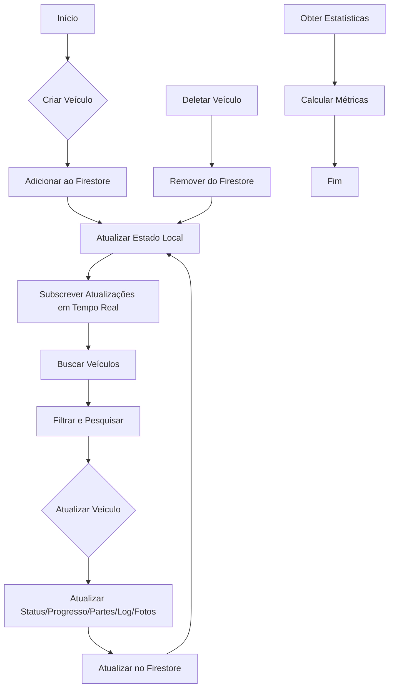

Um sistema completo de gestão para oficinas de motocicletas, desenvolvido com React, Firebase e TailwindCSS.

## 📱 Funcionalidades Principais

### 🔐 Autenticação e Autorização
- Login seguro com Firebase Auth
- Controle de acesso baseado em roles (admin/user)
- Proteção de rotas sensíveis
- Logout automático por inatividade
- Isolamento de dados por organização

### 📊 Dashboard
- Visão geral dos check-ins do dia
- Estatísticas de veículos em tempo real
- Gráficos de performance
- Alertas e notificações
- Métricas de clientes ativos

### 🚗 Gestão de Check-in/Check-out
- Registro rápido de entrada de veículos
- **Upload de até 10 fotos** com interface otimizada
- **Suporte a câmera e galeria** para dispositivos móveis
- Controle de tempo de permanência
- **Exibição em tempo real** nos registros recentes
- Histórico completo de movimentações

### 👥 Gestão de Clientes
- Cadastro completo de clientes
- **Suporte a múltiplos veículos** por cliente
- **Integração com API ViaCEP** para preenchimento automático
- **Validação de CPF** em tempo real
- Sistema de busca avançada
- **Exibição automática** na lista após cadastro
- Histórico de serviços integrado

### 🏍️ Gestão de Veículos
- Cadastro detalhado de motocicletas
- **Busca inteligente** por nome do cliente ou placa
- **Preenchimento automático** de dados do cliente/veículo
- Controle de status (ativa, manutenção, vendida)
- Histórico de serviços
- Filtros e busca avançada
- Validação de placa brasileira

### ⚙️ Configurações
- Perfil da empresa/organização
- **Controle de acesso** restrito a administradores
- Configurações de usuário
- Backup e restauração de dados
- Logs de auditoria

## 🛠️ Tecnologias Utilizadas

### Frontend
- **React 18** - Biblioteca principal
- **Vite** - Build tool e dev server
- **Tailwind CSS** - Framework de estilos
- **Lucide React** - Ícones
- **React Router** - Roteamento
- **React Hot Toast** - Notificações
- **Zustand** - Gerenciamento de estado

### Backend/Database
- **Firebase Auth** - Autenticação
- **Firestore** - Banco de dados NoSQL
- **Firebase Storage** - Armazenamento de arquivos
- **Firebase Hosting** - Deploy da aplicação

### APIs Externas
- **ViaCEP** - Consulta de endereços por CEP
- **Camera API** - Acesso à câmera do dispositivo
- **File API** - Upload de múltiplas imagens

### Ferramentas de Desenvolvimento
- **ESLint** - Linting
- **Prettier** - Formatação de código
- **Git** - Controle de versão

## 📋 Pré-requisitos

- Node.js >= 18.0.0
- npm >= 9.0.0
- Conta no Firebase

## 🚀 Instalação

1. **Clone o repositório**
   ```bash
   git clone <repository-url>
   cd oficina
   ```

2. **Instale as dependências**
   ```bash
   npm install
   ```

3. **Configure o Firebase**
   - Crie um projeto no [Firebase Console](https://console.firebase.google.com/)
   - Ative Authentication, Firestore e Storage
   - Copie as configurações do Firebase
   - Edite o arquivo `src/config/firebase.js` com suas credenciais

4. **Configure as variáveis de ambiente**
   ```bash
   cp .env.example .env
   ```
   Edite o arquivo `.env` com suas configurações do Firebase.

5. **Inicie o servidor de desenvolvimento**
   ```bash
   npm run dev
   ```

## 🔧 Scripts Disponíveis

- `npm run dev` - Inicia o servidor de desenvolvimento
- `npm run build` - Gera a build de produção
- `npm run preview` - Visualiza a build de produção
- `npm run lint` - Executa o linter
- `npm run format` - Formata o código com Prettier
- `npm run format:check` - Verifica a formatação do código

## 📁 Estrutura do Projeto

```
src/
├── components/          # Componentes reutilizáveis
│   ├── ui/             # Componentes de interface
│   ├── layout/         # Componentes de layout
│   ├── auth/           # Componentes de autenticação
│   └── forms/          # Componentes de formulários
├── pages/              # Páginas da aplicação
├── store/              # Gerenciamento de estado (Zustand)
├── config/             # Configurações (Firebase, etc.)
├── i18n/               # Internacionalização
│   └── locales/        # Arquivos de tradução
├── utils/              # Funções utilitárias
├── hooks/              # Custom hooks
└── styles/             # Estilos globais
```

## 🌐 Internacionalização

O sistema suporta múltiplos idiomas:
- Português (pt-BR) - Padrão
- Inglês (en-US)
- Espanhol (es-ES)

Para adicionar um novo idioma:
1. Crie um arquivo JSON em `src/i18n/locales/`
2. Adicione as traduções seguindo a estrutura existente
3. Atualize a configuração em `src/i18n/index.js`

## 🎨 Temas

O sistema suporta:
- Tema claro
- Tema escuro
- Tema automático (baseado na preferência do sistema)

## 🔐 Autenticação

Sistema de autenticação com Firebase Auth:
- Login com email/senha
- Login com Google
- Registro de novos usuários
- Recuperação de senha
- Controle de permissões por função

## 📱 Responsividade

O sistema é totalmente responsivo e otimizado para:
- Desktop
- Tablet
- Mobile

## 🚀 Deploy

Para fazer o deploy:

1. **Build de produção**
   ```bash
   npm run build
   ```

2. **Deploy no Firebase Hosting** (opcional)
   ```bash
   npm install -g firebase-tools
   firebase login
   firebase init hosting
   firebase deploy
   ```

## 🤝 Contribuição

1. Faça um fork do projeto
2. Crie uma branch para sua feature (`git checkout -b feature/AmazingFeature`)
3. Commit suas mudanças (`git commit -m 'Add some AmazingFeature'`)
4. Push para a branch (`git push origin feature/AmazingFeature`)
5. Abra um Pull Request

## 📄 Licença

Este projeto está sob a licença MIT. Veja o arquivo [LICENSE](LICENSE) para mais detalhes.

## 📞 Suporte

Para suporte, entre em contato através do email: suporte@oficina.com

## 🚀 Melhorias Recentes

### v2.3.3 - Melhorias no Check-in
- ✅ **Preenchimento Automático**: Ao selecionar cliente, preenche automaticamente modelo e placa do primeiro veículo
- ✅ **Label Atualizado**: Mudança de "Modelo da Moto" para "Modelo do Veículo" para maior abrangência
- ✅ **UX Aprimorada**: Busca mais intuitiva com preenchimento inteligente dos dados do veículo

### v2.3.2 - Correção da Edição de Clientes
- ✅ **Bug Fix**: Corrigida funcionalidade de edição de clientes que não carregava os dados
- ✅ **Modal Dinâmico**: Título do modal agora muda entre "Novo Cliente" e "Editar Cliente"
- ✅ **Preenchimento Automático**: Dados do cliente são carregados corretamente no formulário de edição
- ✅ **Validação**: Diferenciação entre criação e atualização de clientes

### v2.3.1 - Correção da Busca por CPF/CNPJ
- ✅ **Bug Fix**: Corrigida busca por CPF/CNPJ no clientStore para funcionar igual à página de clientes
- ✅ **Busca Unificada**: Agora a busca no check-in funciona com os mesmos critérios da gestão de clientes
- ✅ **Compatibilidade**: Busca por nome, telefone, CPF, CNPJ e placa funcionando em ambas as páginas

### v2.3.0 - Sistema de Busca Avançada no Check-in
- ✅ **Busca Inteligente no Check-in**: Buscar clientes por placa, nome, CPF ou CNPJ
- ✅ **Criação Rápida de Cliente**: Criar novos clientes diretamente no processo de check-in
- ✅ **Seleção de Veículos**: Selecionar veículo específico do cliente para preenchimento automático
- ✅ **Interface Otimizada**: Modal integrado para criação de cliente sem sair do check-in
- ✅ **Validação em Tempo Real**: Verificação de campos obrigatórios durante a criação

### v2.2.0 - Melhorias de UX e Funcionalidades
- ✅ **Check-in Aprimorado**: Layout de fotos com suporte a até 10 imagens
- ✅ **Interface Mobile**: Botões otimizados para câmera e galeria
- ✅ **Bug Fix**: Check-ins agora aparecem corretamente nos registros recentes
- ✅ **Clientes Múltiplos Veículos**: Suporte a cadastro de vários veículos por cliente
- ✅ **API de CEP**: Integração com ViaCEP para preenchimento automático
- ✅ **Bug Fix**: Clientes aparecem na lista imediatamente após cadastro
- ✅ **Busca Inteligente**: Veículos podem ser encontrados por cliente ou placa
- ✅ **Preenchimento Automático**: Dados do cliente/veículo são preenchidos automaticamente

### v2.1.0 - Sistema de Organização
- ✅ Implementado isolamento de dados por organização
- ✅ Criado `organizationStore.jsx` para gerenciamento centralizado
- ✅ Corrigido bug na `ProfilePage.jsx` para exibir informações da empresa
- ✅ Restringido edição na `SettingsPage.jsx` apenas para administradores
- ✅ Garantido isolamento de dados por `organizationId` em todas as operações
- ✅ Atualizada documentação com fluxograma em Mermaid

### Próximas Funcionalidades
- 🔄 Sistema de relatórios avançados
- 🔄 Integração com APIs de pagamento
- 🔄 Notificações push
- 🔄 Backup automático
- 🔄 Dashboard analytics avançado
- 🔄 Sincronização offline
- 🔄 Exportação de dados em PDF/Excel

---

**Desenvolvido com ❤️ para oficinas de motocicletas**


## 🔄 Fluxo do Sistema

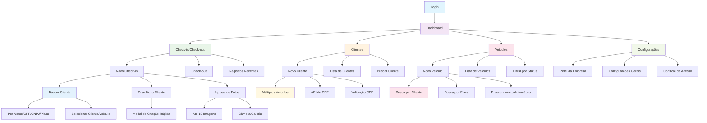

## Fluxo de Login e Roles

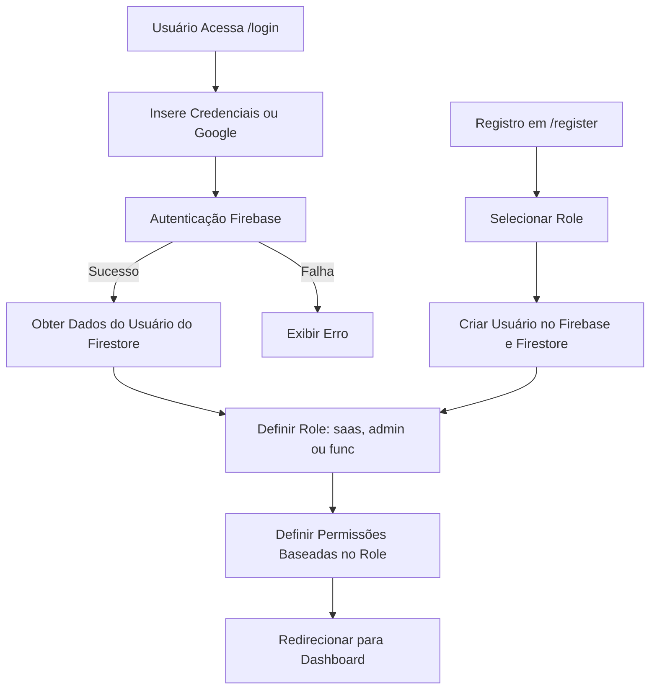

## Correções de Código Realizadas

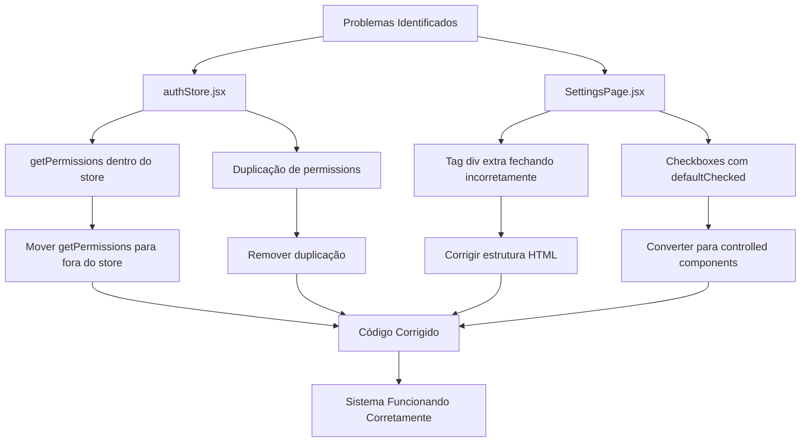

## Fluxo de Design da Página de Login

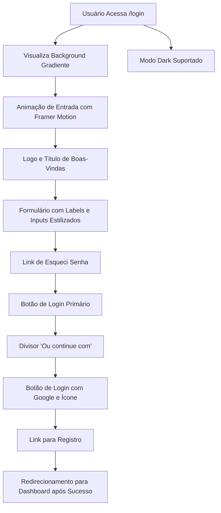

## Fluxo de Design Dark Premium da Página de Login

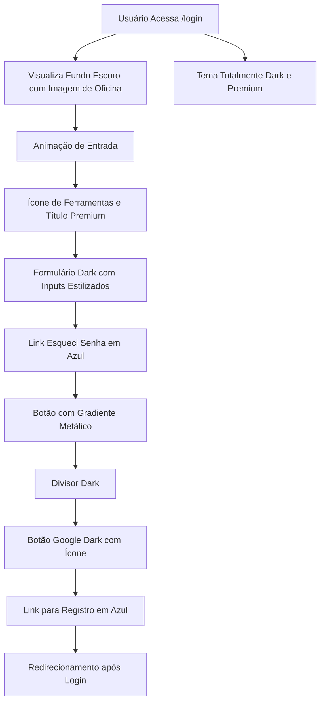

## Fluxo de Design com Efeito Blur no Fundo da Página de Login

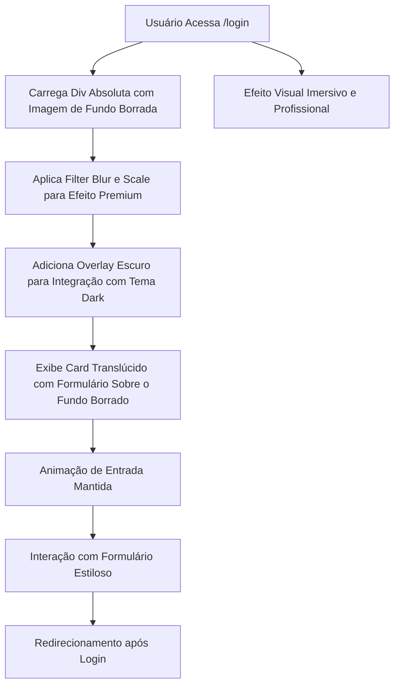

## Fluxo de Design Blur Estilo Figma com Ícones Temáticos

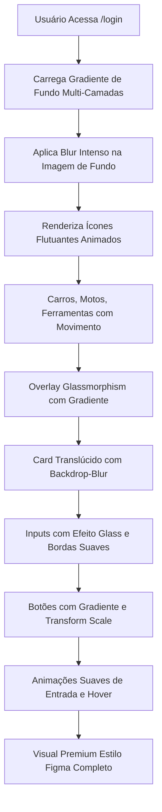

## Fluxo de Registro com Validação de Pessoa Física/Jurídica

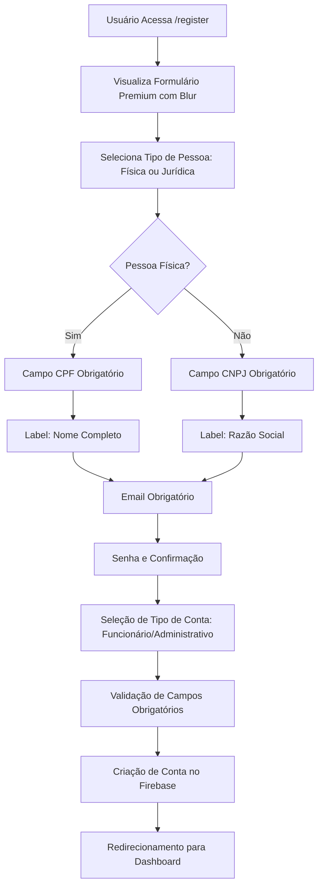

## Fluxo de Autenticação Google com Verificação de Dados

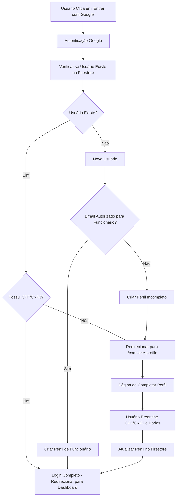

## 📊 Fluxograma do Sistema de Gerenciamento de Funcionários

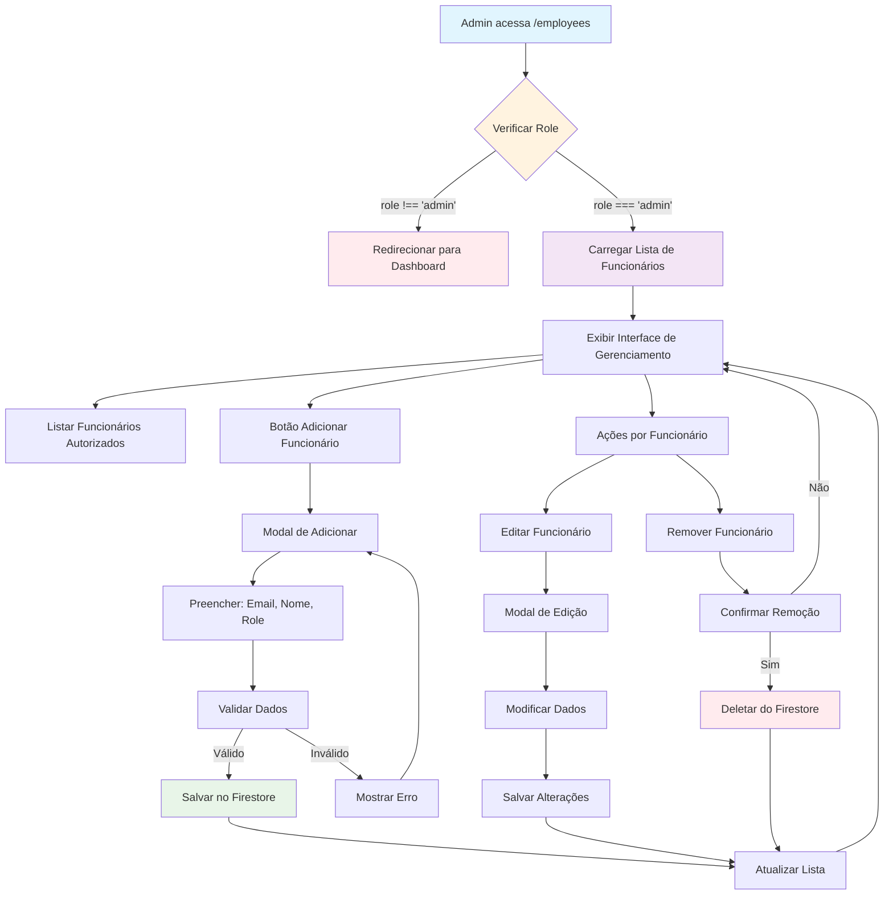

## 🏢 Fluxograma do Sistema de Organização e Perfil

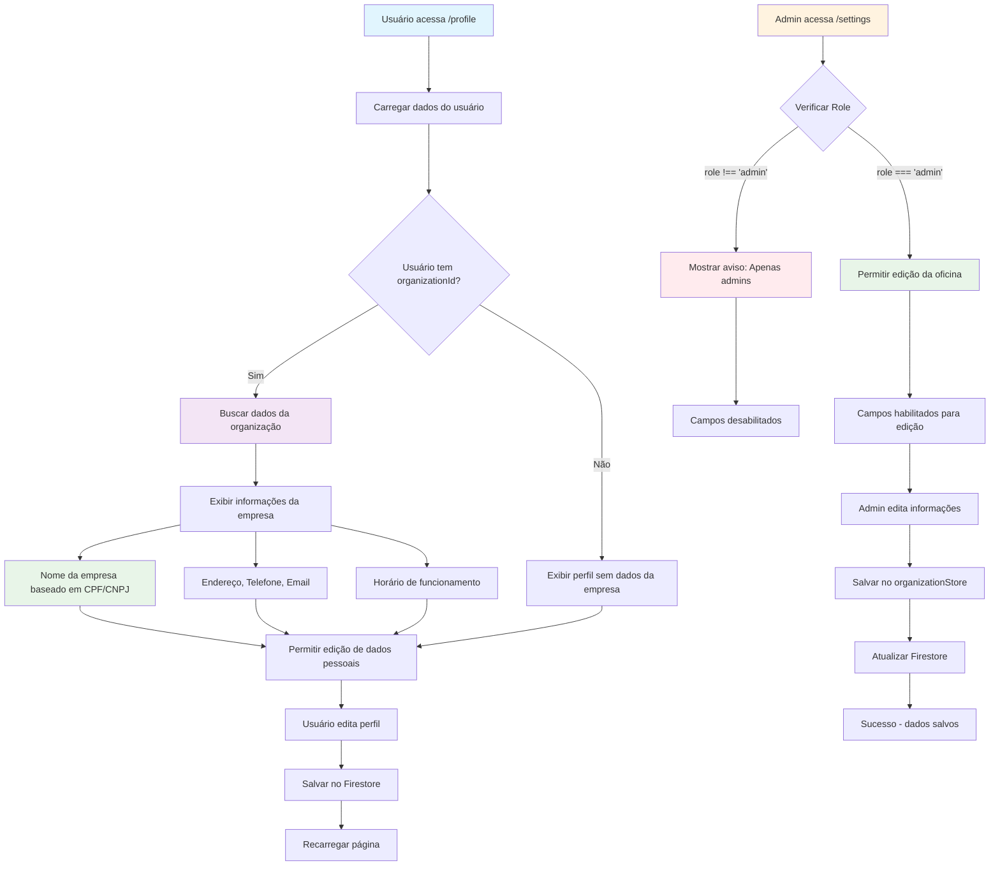

## 🔐 Fluxograma do Sistema de Isolamento de Dados por Organização

```mermaid
flowchart TD
    A[Usuário faz login] --> B[Verificar dados no Firestore]
    B --> C{Usuário existe?}
    C -->|Não| D[Criar novo usuário]
    C -->|Sim| E[Carregar dados existentes]
    
    D --> F[Gerar organizationId]
    E --> G{Tem organizationId?}
    G -->|Não| F
    G -->|Sim| H[Usar organizationId existente]
    
    F --> I[organizationId = hash(cpfCnpj || cnpj || cpf || uid)]
    I --> J[Salvar usuário com organizationId]
    H --> K[Carregar dados da organização]
    J --> L[Criar organização se não existir]
    
    K --> M[Filtrar dados por organizationId]
    L --> M
    M --> N[Usuário acessa apenas dados da sua organização]
    
    N --> O[Funcionários da mesma organização]
    N --> P[Configurações da mesma organização]
    N --> Q[Clientes da mesma organização]
    
    O --> R[Isolamento completo entre empresas]
    P --> R
    Q --> R
    
    style A fill:#e1f5fe
    style F fill:#fff3e0
    style I fill:#f3e5f5
    style M fill:#e8f5e8
    style R fill:#e8f5e8
```

## 🔍 Fluxograma do Sistema de Busca Avançada no Check-in

```mermaid
flowchart TD
    A[Usuário acessa Novo Check-in] --> B[Interface de Busca de Cliente]
    B --> C[Campo de busca: Nome/CPF/CNPJ/Placa]
    B --> D[Botão: Buscar Cliente]
    B --> E[Botão: Criar Novo Cliente]
    
    C --> F[Usuário digita termo de busca]
    F --> G[Enter ou clique em Buscar]
    G --> H[Executar searchClients()]
    
    H --> I[Buscar por nome, CPF, CNPJ]
    H --> J[Buscar por placa nos veículos]
    I --> K[Combinar resultados]
    J --> K
    
    K --> L{Resultados encontrados?}
    L -->|Sim| M[Exibir lista de clientes]
    L -->|Não| N[Mostrar "Nenhum resultado"]
    
    M --> O[Cliente sem veículos]
    M --> P[Cliente com veículos]
    
    O --> Q[Clicar para selecionar cliente]
    P --> R[Mostrar lista de veículos]
    P --> S[Clicar no cliente]
    P --> T[Clicar em veículo específico]
    
    Q --> U[Preencher dados do cliente]
    S --> U
    T --> V[Preencher cliente + dados do veículo]
    
    E --> W[Abrir modal de novo cliente]
    W --> X[Preencher: Nome*, Telefone*, CPF, Email]
    X --> Y[Validar campos obrigatórios]
    Y -->|Válido| Z[Criar cliente via createClient()]
    Y -->|Inválido| AA[Mostrar erro]
    
    Z --> BB[Cliente criado com sucesso]
    BB --> CC[Preencher formulário automaticamente]
    AA --> X
    
    U --> DD[Continuar com check-in]
    V --> DD
    CC --> DD
    N --> E
    
    DD --> EE[Upload de fotos]
    EE --> FF[Finalizar check-in]
    
    style A fill:#e1f5fe
    style H fill:#f3e5f5
    style K fill:#fff3e0
    style M fill:#e8f5e8
    style W fill:#fce4ec
    style Z fill:#e8f5e8
    style DD fill:#f1f8e9
```