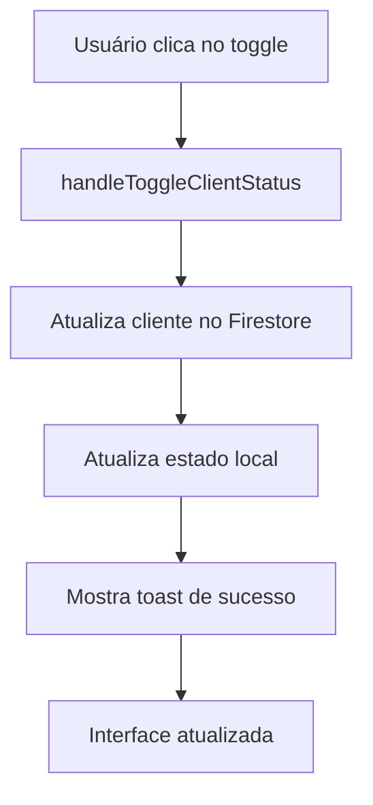
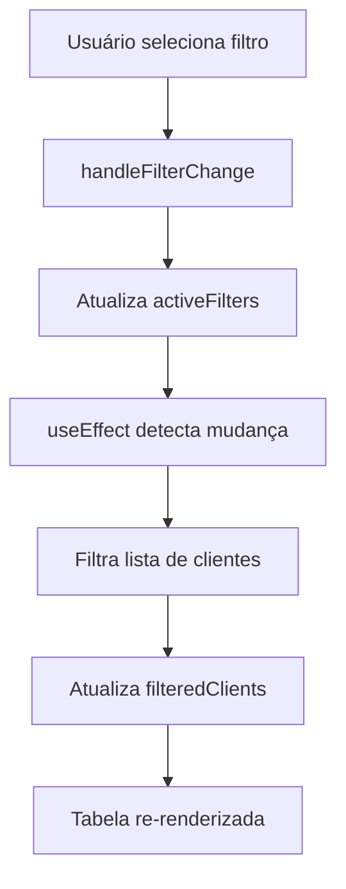

# 🔄 Sistema de Ativação/Desativação de Clientes - Implementado

## ✅ Funcionalidade Implementada

Substituí o botão "Excluir cliente" por um sistema elegante de ativação/desativação com toggle switch e adicionei um filtro estratégico para gerenciar clientes ativos e inativos.

## 🎯 **Principais Melhorias**

### 1. **Toggle Switch Elegante** ✅
- **Substituiu**: Botão de excluir (destrutivo)
- **Por**: Toggle switch suave estilo Apple
- **Funcionalidade**: Ativar/desativar clientes sem perder dados
- **Localização**: Coluna "Status" na tabela de clientes

### 2. **Filtro Estratégico de Clientes** ✅
- **Localização**: Ao lado da barra de busca (canto superior direito)
- **Funcionalidades**: Filtrar por status, período e localização
- **Design**: Dropdown elegante com glassmorphism
- **Estatísticas**: Mostra contadores em tempo real

## 🛠️ **Componentes Criados**

### 📦 **ToggleSwitch.jsx**
Componente toggle switch reutilizável estilo Apple.

#### **Funcionalidades:**
- ✅ **Animações suaves** com Framer Motion
- ✅ **Múltiplos tamanhos** (sm, md, lg)
- ✅ **Ícones opcionais** (Check/X)
- ✅ **Cores customizáveis** (verde/vermelho)
- ✅ **Estados disabled** com feedback visual
- ✅ **Efeitos de hover** e tap

#### **Props Disponíveis:**
```javascript
<ToggleSwitch
  enabled={true}                    // Estado atual
  onChange={(newState) => {}}       // Callback de mudança
  size="md"                         // sm, md, lg
  disabled={false}                  // Desabilitar toggle
  showIcons={true}                  // Mostrar ícones Check/X
  enabledColor="bg-green-500"       // Cor quando ativo
  disabledColor="bg-red-500"        // Cor quando inativo
  className=""                      // Classes CSS extras
/>
```

### 📦 **ClientFilter.jsx**
Componente de filtro avançado para clientes.

#### **Funcionalidades:**
- ✅ **Filtro por status** (todos, ativos, inativos)
- ✅ **Filtro por período** (hoje, semana, mês, ano)
- ✅ **Filtro por localização** (cidade local, outras)
- ✅ **Contadores em tempo real** para cada categoria
- ✅ **Dropdown animado** com glassmorphism
- ✅ **Botão limpar filtros** quando há filtros ativos
- ✅ **Indicador visual** de filtros aplicados

#### **Props Disponíveis:**
```javascript
<ClientFilter
  onFilterChange={(filters) => {}}  // Callback de mudança
  activeFilters={{}}                // Filtros atualmente ativos
  totalClients={100}                // Total de clientes
  activeClients={85}                // Clientes ativos
  inactiveClients={15}              // Clientes inativos
/>
```

## 🎨 **Interface Atualizada**

### **Antes vs Depois:**

#### **❌ Antes (Destrutivo):**
```
┌─────────────────────────────────────┐
│ Nome    │ Email    │ Telefone │ Ações │
├─────────────────────────────────────┤
│ João    │ joao@... │ (11)...  │ [🗑️]  │ ← Botão excluir
└─────────────────────────────────────┘
```

#### **✅ Depois (Não-destrutivo):**
```
┌─────────────────────────────────────────────┐
│ Nome    │ Email    │ Telefone │ Status      │
├─────────────────────────────────────────────┤
│ João    │ joao@... │ (11)...  │ [🟢] Ativo  │ ← Toggle switch
└─────────────────────────────────────────────┘
```

### **Filtro Estratégico:**
```
┌─────────────────────────────────────────────┐
│ [🔍 Buscar clientes...] [📊 Filtros ▼]     │
└─────────────────────────────────────────────┘
                            │
                            ▼
                    ┌─────────────────┐
                    │ 📊 Filtrar      │
                    ├─────────────────┤
                    │ Status:         │
                    │ ✓ Todos (100)   │
                    │   Ativos (85)   │
                    │   Inativos (15) │
                    ├─────────────────┤
                    │ Período:        │
                    │ ✓ Todos         │
                    │   Esta semana   │
                    │   Este mês      │
                    └─────────────────┘
```

## 🔄 **Fluxo de Funcionamento**

### **1. Ativação/Desativação:**


### **2. Filtros:**


## 📊 **Lógica de Filtros**

### **Status do Cliente:**
```javascript
// Por padrão, clientes são ativos (active !== false)
const isActive = client.active !== false;

// Filtro por status
if (activeFilters.status === 'active') {
  filtered = clients.filter(c => c.active !== false);
} else if (activeFilters.status === 'inactive') {
  filtered = clients.filter(c => c.active === false);
}
```

### **Filtro por Período:**
```javascript
// Exemplo: filtro por mês atual
if (activeFilters.period === 'month') {
  filtered = clients.filter(client => {
    const clientDate = new Date(client.createdAt);
    return clientDate.getMonth() === now.getMonth() && 
           clientDate.getFullYear() === now.getFullYear();
  });
}
```

## 🎯 **Benefícios da Implementação**

### ✅ **Para o Usuário:**
- **Não-destrutivo**: Clientes nunca são perdidos
- **Reversível**: Pode reativar clientes a qualquer momento
- **Intuitivo**: Toggle switch familiar (estilo iOS)
- **Organizado**: Filtros ajudam a gerenciar grandes listas

### ✅ **Para o Negócio:**
- **Dados preservados**: Histórico de clientes mantido
- **Relatórios**: Pode analisar clientes inativos
- **Reativação**: Campanhas para clientes inativos
- **Compliance**: Atende regulamentações de retenção de dados

### ✅ **Para o Sistema:**
- **Performance**: Filtros reduzem dados exibidos
- **Escalabilidade**: Suporta grandes volumes de clientes
- **Manutenibilidade**: Código mais limpo e organizado
- **Flexibilidade**: Fácil adicionar novos filtros

## 🎨 **Design System**

### **Cores do Toggle:**
- **Ativo**: Verde (#10b981) com gradiente
- **Inativo**: Vermelho (#ef4444) com gradiente
- **Thumb**: Branco com sombra sutil
- **Ícones**: Check (verde) / X (vermelho)

### **Animações:**
- **Toggle**: Spring animation (500ms)
- **Filtro**: Fade + scale (200ms)
- **Hover**: Scale 1.02 (suave)
- **Tap**: Scale 0.98 (feedback tátil)

## 📱 **Responsividade**

### **Desktop:**
- Filtro ao lado da busca (horizontal)
- Toggle com label "Ativo/Inativo"
- Dropdown completo com todas as opções

### **Mobile:**
- Filtro abaixo da busca (vertical)
- Toggle compacto sem label
- Dropdown adaptado para toque

## 🔧 **Configurações Avançadas**

### **Personalização do Toggle:**
```javascript
// Toggle customizado
<ToggleSwitch
  enabled={client.active}
  onChange={(status) => handleToggle(client.id, status)}
  size="sm"
  enabledColor="linear-gradient(135deg, #10b981, #059669)"
  disabledColor="linear-gradient(135deg, #ef4444, #dc2626)"
  showIcons={true}
/>
```

### **Filtros Personalizados:**
```javascript
// Adicionar novos filtros
const customFilters = {
  vip: {
    label: 'Clientes VIP',
    options: [
      { value: 'all', label: 'Todos' },
      { value: 'vip', label: 'Apenas VIP' },
      { value: 'regular', label: 'Regulares' }
    ]
  }
};
```

## 🎉 **Resultado Final**

### ✅ **Interface Moderna:**
- **Toggle switches** elegantes estilo Apple
- **Filtros inteligentes** com contadores
- **Animações suaves** em todas as interações
- **Design consistente** com o sistema

### ✅ **Funcionalidade Completa:**
- **Ativação/desativação** sem perda de dados
- **Filtros múltiplos** para organização
- **Busca combinada** com filtros
- **Estatísticas em tempo real**

### ✅ **Experiência do Usuário:**
- **Não-destrutivo** - dados sempre preservados
- **Intuitivo** - controles familiares
- **Eficiente** - filtros reduzem ruído visual
- **Profissional** - interface polida e moderna

**Sistema de ativação/desativação de clientes implementado com sucesso! 🚀**